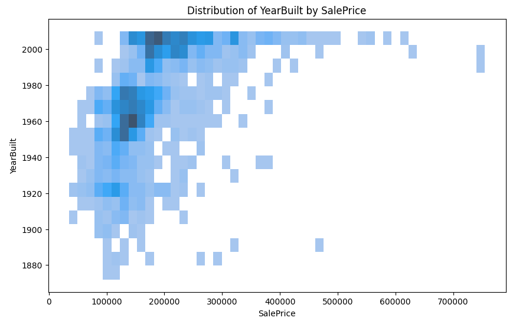

# 

## Template Instructions

Welcome,

this is my project 5 - hose market pricing...

## How to use this repo

1. Use this template to create your GitHub project repo

2. Log into the cloud-based IDE with your GitHub account.

3. On your Dashboard, click on the Create button

4. Paste in the URL you copied from GitHub earlier

5. Click Create

6. Wait for the workspace to open. This can take a few minutes.

7. Open a new terminal and `pip3 install -r requirements.txt`

8. Open the jupyter_notebooks directory and click on the notebook you want to open.

9. Click the kernel button and choose Python Environments.

Note that the kernel says Python 3.12.2 as it inherits from the workspace so it will be Python-3.12.2 as installed by our template. To confirm this you can use `! python --version` in a notebook code cell.

## Cloud IDE Reminders

To log into the Heroku toolbelt CLI:

1. Log in to your Heroku account and go to *Account Settings* in the menu under your avatar.
2. Scroll down to the *API Key* and click *Reveal*
3. Copy the key
4. In your Cloud IDE, from the terminal, run `heroku_config`
5. Paste in your API key when asked

You can now use the `heroku` CLI program - try running `heroku apps` to confirm it works. This API key is unique and private to you so do not share it. If you accidentally make it public then you can create a new one with *Regenerate API Key*.

## Dataset Content

* The dataset is sourced from [Kaggle](https://www.kaggle.com/codeinstitute/housing-prices-data). A fictitious user story is applied where predictive analytics can be applied in a real project in the workplace.
* The dataset has almost 1.5 thousand rows and represents housing records from Ames, Iowa, indicating house profile (i.e. Floor Area, Basement, Garage, Kitchen, Lot, Porch, Wood Deck, Year Built) and its respective sale price for houses built between 1872 and 2010.

|Variable|Meaning|Units|
|:----|:----|:----|
|1stFlrSF|First Floor square feet|334 - 4692|
|2ndFlrSF|Second-floor square feet|0 - 2065|
|BedroomAbvGr|Bedrooms above grade (does NOT include basement bedrooms)|0 - 8|
|BsmtExposure|Refers to walkout or garden level walls|Gd: Good Exposure; Av: Average Exposure; Mn: Minimum Exposure; No: No Exposure; None: No Basement|
|BsmtFinType1|Rating of basement finished area|GLQ: Good Living Quarters; ALQ: Average Living Quarters; BLQ: Below Average Living Quarters; Rec: Average Rec Room; LwQ: Low Quality; Unf: Unfinshed; None: No Basement|
|BsmtFinSF1|Type 1 finished square feet|0 - 5644|
|BsmtUnfSF|Unfinished square feet of basement area|0 - 2336|
|TotalBsmtSF|Total square feet of basement area|0 - 6110|
|GarageArea|Size of garage in square feet|0 - 1418|
|GarageFinish|Interior finish of the garage|Fin: Finished; RFn: Rough Finished; Unf: Unfinished; None: No Garage|
|GarageYrBlt|Year garage was built|1900 - 2010|
|GrLivArea|Above grade (ground) living area square feet|334 - 5642|
|KitchenQual|Kitchen quality|Ex: Excellent; Gd: Good; TA: Typical/Average; Fa: Fair; Po: Poor|
|LotArea| Lot size in square feet|1300 - 215245|
|LotFrontage| Linear feet of street connected to property|21 - 313|
|MasVnrArea|Masonry veneer area in square feet|0 - 1600|
|EnclosedPorch|Enclosed porch area in square feet|0 - 286|
|OpenPorchSF|Open porch area in square feet|0 - 547|
|OverallCond|Rates the overall condition of the house|10: Very Excellent; 9: Excellent; 8: Very Good; 7: Good; 6: Above Average; 5: Average; 4: Below Average; 3: Fair; 2: Poor; 1: Very Poor|
|OverallQual|Rates the overall material and finish of the house|10: Very Excellent; 9: Excellent; 8: Very Good; 7: Good; 6: Above Average; 5: Average; 4: Below Average; 3: Fair; 2: Poor; 1: Very Poor|
|WoodDeckSF|Wood deck area in square feet|0 - 736|
|YearBuilt|Original construction date|1872 - 2010|
|YearRemodAdd|Remodel date (same as construction date if no remodelling or additions)|1950 - 2010|
|SalePrice|Sale Price|34900 - 755000|

## Business Requirements

My friend received an inheritance from a deceased great-grandfather located in Ames, Iowa, to  help in maximising the sales price for the inherited properties.

Although my friend has an excellent understanding of property prices in her own state and residential area, she fears that basing her estimates for property worth on her current knowledge might lead to inaccurate appraisals. What makes a house desirable and valuable where she comes from might not be the same in Ames, Iowa. She found a public dataset with house prices for Ames, Iowa, and will provide you with that.

* 1 - The client is interested in discovering how the house attributes correlate with the sale price. Therefore, the client expects data visualisations of the correlated variables against the sale price to show that.
* 2 - The client is interested in predicting the house sale price from her four inherited houses and any other house in Ames, Iowa.

## Hypothesis and how to validate

### Hypothesis: Larger square footage often correlates with higher sales prices. (Correct.)

I suspect the sales price correlates with a high amount of ground living area.

How to validate:

* Analyse the dataset and provide a correlation analysis about sales price. See [02_data_cleaning: Correlation analysis](jupyter_notebooks/02b_house_market_study.ipynb)

* Plot a scatter plot of price vs square_footage. See [02b_house_market_study: Distribution of GrLivArea by SalePrice](jupyter_notebooks/02b_house_market_study.ipynb)

### Hypothesis: More bedrooms, higher sales price. (Wrong.)

How to validate:

* Use boxplots or plot of price vs number of bedrooms to compare average prices across different numbers of bedrooms.

Correlation value BedroomAbvGr/SalePrice: 0.161901

### Hypothesis: Better OverallCond, higher sales price. (Wrong.)

How to validate:

* Use boxplots or plot of price vs overall condition to compare average prices across categories of overall condition.

Correlation value OverallCond/SalePrice: -0.077856

### Hypothesis: Renovated houses sell for more (Partly correct.)

How to validate:

* Compare average prices of renovated vs not renovated homes.
* Check if the year of renovation is recent, and see if it correlates with price increase.

Correlation value YearRemodadd/SalePrice: 0.507101

### Hypothesis: Newer houses are more expensive (Partly correct.)

How to validate:

* Analyze the relationship between year_built and price.
* Convert year to age of house (current_year - year_built) if needed.
* Run correlation and scatterplots, or use regression analysis.

Correlation value YearBuilt/SalePrice: 0.522897

### Hypothesis: Luxury or convenience features often raise prices (GarageArea, OverallQual, OverallCond)

* A house market study showed the sales price correlates with \n "
* A house with a value between $100.000 - $150.000 typically has GrLivArea = , OverallQual = , as demonstrated by a house maket study.\n "
* A house with a value between $150.000 - $300.000 typically has GrLivArea = , OverallQual = , as demonstrated by a house maket study.\n "
* A house with a value min. $300.000 typically has GrLivArea = , OverallQual = , as demonstrated by a house maket study.\n "

How to validate:

* Analyze certain attributes such as 'OverallQual', 'GarageSF', 'EnclosedPorch' and ceate the clusters low-, mid- and high_price

This insight will be used by the survey team for further discussions and investigations.

## The rationale to map the business requirements to the Data Visualisations and ML tasks

List of business requirements and a rationale to map them to the Data Visualisations and ML tasks.

|  Business requierement | relevant section of visualisations and ML task |
| --- | --- |
| 1 | See [02b_data_cleaning](jupyter_notebooks/02b_house_market_study.ipynb) |
| 2 | See [04_modeling and evaluation](jupyter_notebooks/04_modeling_and_evaluation.ipynb) |

## Data collection

[01_data_collection](jupyter_notebooks/01_data_collection.ipynb)

The dataset is loaded into a pandas DataFrame and an initial inspection is performed to understand its structure, dimensions, and content (Load and inspect the Kaggle dataset). Data types of all columns are reviewed to distinguish between numerical and non-numerical features, which is essential for preprocessing and model selection. The following parameter do not have a numeric type: ['BsmtExposure', 'BsmtFinType1', 'GarageFinish', 'KitchenQual'], dtype='object'.
In addition, the dataset is analyzed to detect columns with missing values. The number of missing entries per column is calculated and presented in descending order to highlight areas requiring attention. The following columns have missing Values: ['EnclosedPorch', 'WoodDeckSF', 'LotFrontage ', 'GarageFinish', 'BsmtFinType1', 'BedroomAbvGr', '2ndFlrSF', 'GarageYrBlt', 'BsmtExposure', 'MasVnrArea']. Last but not least, columns containing zero values are identified and evaluated. The total number of zero values in the dataset is reported, along with a breakdown per column, to assess if zeros may represent missing or invalid data.
The following columns have the value zero: ['MasVnrArea', '2ndFlrSF', 'openPorchSF', 'BsmtFinSF1', 'BsmtUnfSF', 'EnclosedPorch', 'GarageArea', 'WoodDeckSF', 'TotalBsmtSF', 'BedroomAbvGr']. All values should remain, since it is an indication that the relevatn attribute is not available.

## Data cleaning

[02_data_cleaning](jupyter_notebooks/02_data_cleaning.ipynb)

### Handling missing values

There are missing data. For cleaning it the function DataCleaningEffect() is used (from feature-engine lession)

a. Drop Columns:
If a column has a very high proportion of missing data such as 'EnclosedPorch' and 'WoodDeckSF', it may be best to drop the column altogether. As well as for LotFrontage (259 missing).

b. Impute Missing Values:
For columns with a moderate amount of missing data, imputation is a good strategy. There are different methods for imputing based on the nature of the data

* For numeric columns (e.g., 2ndFlrSF, BedroomAbvGr, BsmtExposure, GarageYrBlt): You can impute the missing values using the mean, median, or mode (depending on the distribution of the data). The median is often a good choice for columns with skewed distributions or outliers.
* For categorical columns (e.g., BsmtExposure, BsmtFinType1, GarageFinish): Impute the missing values with the mode (most frequent value) since these are categorical variables.
* For columns like MasVnrArea (small number of missing values): Since MasVnrArea has only 8 missing values, impute using the mean or median, or even consider using the mode depending on the column’s nature. If the percentage is very small, drop rows with missing values in some cases.
* For GarageYrBlt (81 missing): An imputation with with the mode or mean of the year values is not useful. Using a more sophisticated method, like predictive modeling or filling based on group statistics (e.g., grouping by the presence of a garage) is better.

c. Fill Missing with Specific Values:
For certain categorical columns, you might want to fill missing values with a specific placeholder like 'Unknown' or 'None' if that's a valid way to handle missing data for that variable.

By using a machine learning model, more sophisticated imputation techniques can be used, such as:

* K-Nearest Neighbors (KNN) imputation: Uses the values of the closest data points to impute missing values (source: YOUTUBE, add !!LINK!!).
* Regression-based imputation: You can use a regression model to predict missing values based on other features in the dataset (source: YOUTUBE, add !!LINK!!).

**Current approach:**

* Drop columns with a very high percentage of missing values (e.g., EnclosedPorch, WoodDeckSF)
* Impute missing values for columns with moderate missing data:
  * Numeric columns (e.g., 2ndFlrSF, BedroomAbvGr) using the mean, median, or mode.
  * Categorical columns (e.g., BsmtExposure, BsmtFinType1) using the mode (most frequent value).
* For small missing data counts (e.g., MasVnrArea), impute with the mean or median.

Considering regression-based and model-based imputation for more advanced techniques (tbd!!MERIT!!)

### Correlation matrix

## Feature engineering

### Zeros in the dataset

The analysis shows that there are zeros in the dataset. Whether those should be transformed depends on:

* The nature of the feature (binary, categorical, or continuous).
* The interpretation of zeros (absence vs. a true zero value).
* The impact of zeros on the target variable (do they have predictive power?).

The zeros represent absence of a feature (e.g., 2ndFlBsmt is a binary flag indicating the presence of a second-floor basement). I don't need to transform them. There are two opitons: A - creating additional features (like a binary indicator for zero values) or B - leave them as-is. (!!add decision!!)

### YData Profiling Report

The report enables to have a closer look at each variable. The following insighs are noticeable:

| variable | comment |
|--|--|
| 2stFlrSF | ~59% zeros, only 41% of the houses have a 2st floor |
| BsmtFinSF1 | 32% of the houses don't have a basement |
| GarageArea | 94% of the houses have a garage, it seems a garage is not a convenient, but mandatory attribute in the market. If a garage is finished or unfinished is not correlating with sales price. |
| TotalBsmtSF | THere are only 2,5% of the houses which don't have a basement. It seems a basement is a mandatory attribute. |
| YearBuilt | A big amount of houses in the dataset has been built around 2000 (!! Details!!). It seems there are a lot new houses in the market. |
| YearRemodAdd | A noticable amount of houses has been renovated around 2000. (!! Details!!) |

### 1. Categorical Encoding

Categorical variables represent discrete categories. Machine learning models generally require numeric inputs, so categorical variables must be encoded into a numerical form. For the convertion the Label Encoding has been applied. It assigns each category a unique integer.

In the jupyter notebook '02_data cleaning'. The following parameters has been transformed (for correlation analysis): 'BsmtExposure', 'BsmtFinType1' and 'GarageFinish'.
In jupyter notebook '04_modeling_and_evaluation'. The following parameters has been transformed (for pipeline model): (...).

### 2. Numerical Transformation

Numerical features often need to be transformed to improve model performance, especially if their distribution is skewed.
Common Transformation Techniques:

* Normalization: Scaling the values to a range, typically between 0 and 1.
* Standardization: Scaling the values to have a mean of 0 and a standard deviation of 1.
* Log Transformation: Helps with highly skewed data by compressing the range.

Within this project the log transformation is done for 'SalePrice' and 'GarageArea' since thir distribution is skewed.

### 3. Smart Correlation Selection

In a dataset, some features may be highly correlated with others. Keeping highly correlated features in a model can lead to multicollinearity, which can negatively impact model performance.
Method to Select Features Based on Correlation:

* Correlation Matrix: You can compute the correlation matrix to find highly correlated pairs.
* Threshold-based Feature Removal: Remove features that have a correlation higher than a certain threshold, e.g., 0.8 or -0.8.

Within this project, based on the correlation analysis for salePrice and further interpretation of the context the following parameters will be ignored:
'TotalBsmtSF', '1stFlrSF', 'YearRemodAdd', 'GarageYrBlt', 'MasVnrArea', 'BsmtFinSF1', '2ndFlrSF'

***1stFlrSF***:

This feature represents the area of the first floor. It is likely correlated with other features like GrLivArea (the total above-ground living area) or TotalBsmtSF (the total basement area). Including both could introduce redundancy in the model.

Action: Drop this feature to avoid multicollinearity. Keep GrLivArea as it represents the total above-ground living space, which is likely more informative.

***GrLivArea***:

This feature is related to some variables related to the total above-ground living area, which is a strong indicator of house size and price. It’s already closely related to 1stFlrSF, TotalBsmtSF, TotalArea and might also have a relationship with 2ndFlrSF.

Action: This feature is kept. However, feature 2ndFlrSF is being dropped to simplify the model and reduce multicollinearity.

***SalePrice***:

This is the log-transformed version of the target variable, SalePrice. It's highly correlated with GarageArea as well, as shown in the earlier analysis. Since SalePrice is the target variable (the dependent variable you are trying to predict), it should not be used as an independent variable in the model. Hence, it’s correct to drop this feature from the set of predictors, but still necessary for the train and test set.

Action:  'Saleprice' is kept for test and train set. 'GarageArea' is dropped.

***OverallQual***:

This feature represents the overall quality of the house and is highly correlated with KitchenQual and YearBuilt. Since OverallQual is a general measure of the house’s quality, it may be more valuable for predicting SalePrice than other more specific quality features like KitchenQual. In addition, OverallQual does have the highest correlation to SalePrice in the correlation anylsis (02_data_cleaning).

Action: OverallQual is kept, YearBuilt is dropped.

***KitchenQual***:

This feature represents the quality of the kitchen, which may be closely related to the overall quality of the house (OverallQual). Dropping one of these two features will reduce redundancy in your dataset.

Action: Drop KitchenQual because OverallQual might already capture the overall quality of the house, including the kitchen.

### 4. Discretization (Binning)

Discretization (or binning) is the process of transforming continuous variables into categorical ones. This is useful if you want to reduce the impact of outliers or make certain trends more interpretable.

Ideas:

* 'EnlosedPorch': 1. Yes, 2. No
* 'MasVnrArea': 1. Yes, 2. No
(in progress)

### 5. Outlier Detection and Treatment

Outliers can distort model performance and lead to incorrect predictions. Various methods can be used to detect and handle outliers.
Common Outlier Detection Methods:

* IQR (Interquartile Range) Method: Detect outliers based on the IQR, typically using a threshold of 1.5 * IQR.
* Z-score Method: Detect outliers based on the Z-score (values above a certain threshold).

Since the outliers for SalePrice represent real, valid data points, I keep them in the model. The dataset contains examples of extreme property prices, the model should be trained on those extreme values. This ensures the model can predict for higher prices in the future. Example: If you have properties worth $1,000,000 or more, and they are valid sales, it’s important to include them.

A log transformation to the target variable SalePrice is used for Numerical Transformation. This transformation will compress the high values, making the distribution more symmetric and reducing the effect of extreme values, but still allowing the model to learn the overall patterns.

Some machine learning models are more robust to outliers than others. For instance: Random Forest, Gradient Boosting (like XGBoost), and Decision Trees handle outliers relatively well. Linear regression models, however, are more sensitive to extreme outliers and might give distorted results when exposed to such values. Therefore, a more robust ML model is selected.

### Feature Engineering Spreadsheet summary

* Categorical Encoding (already done in 02_data_cleaning)
* Numerical Transformation (log transformation): 'SalePrice', 'GrLivArea'
* Smart Correlated Selection (there are a various varables with can be dropped due to a high correlation match): ['TotalBsmtSF', '1stFlrSF', 'GarageArea', 'GrLivArea', '2ndFlrSF', 'SalePrice', 'KitchenQual', 'YearBuilt']

| variabels | comment | correlation with SalePrice | Potential Feature Engineering Transformers |
|---|---|---|---|
|Sale Price| | 1 | Numerical Transformation |
|1stFlrSF|  |  |  |
|2ndFlrSF| MIssing values are filled up by adding median()  |  |  |
|BedroomAbvGr| droped from dataset due to low correlation | | |
|BsmtExposure| identified as dtype='object', droped from dataset due to low correlation | | |
|BsmtFinType1| droped from dataset due to low correlation | | |
|BsmtFinSF1| identified as dtype='object' |  |  |
|BsmtUnfSF| droped from dataset due to low correlation | | |
|TotalBsmtSF|  |  |  |
|GarageArea|  |  |  |
|GarageFinish| identified as dtype='object', Missing values (NaNs) in the GarageFinish columns are filled wih the most frequent value found in that column. | | |
|GarageYrBlt|  |  |  |
|GrLivArea|  |  |  |
|KitchenQual| identified as dtype='object' |  |  |
|LotArea|  droped from dataset due to low correlation | | |
|LotFrontage|  |  |  |
|MasVnrArea| It fills all missing values in the MasVnrArea column with the mean of the existing (non-null) values in that column. |  |  |
|EnclosedPorch| droped from dataset due to low correlation and high number of missing values.|  |  |
|OpenPorchSF|  |  |  |
|OverallCond| droped from dataset due to low correlation | | |
|OverallQual|  | 0.790982 | |
|WoodDeckSF| droped from dataset due to low correlation and high number of missing values |  |  |
|YearBuilt|  |  |  |
|YearRemodAdd|  |  |  |

## ML Business Case

* In the previous bullet, you potentially visualised an ML task to answer a business requirement. You should frame the business case using the method we covered in the course.

The ML task was done by following the CRISP-DM workflow.

## Dashboard Design

* List all dashboard pages and their content, either blocks of information or widgets, like buttons, checkboxes, images, or any other items that your dashboard library supports.

| Dashboard page name | Screenshot | Content | Comment |
| --- | --- | --- | --- | --- |
| page_project summary |  |  |  |
| page_house_market_study |  |  |  |
| page_project_hypothesis_and_validation |  |  |  |
| page_sales_price_predictor |  |  |  |
| page_pipeline_performance |  |  |  |

## Unfixed Bugs

* You will need to mention unfixed bugs and why they were not fixed. This section should include shortcomings of the frameworks or technologies used. Although time can be a big variable to consider, paucity of time and difficulty understanding implementation is not valid reason to leave bugs unfixed.

|Error message | Code | Comment | Fix |
|---|---|---|---|
| KeyError: "['TotalArea'] not found in axis" | df_engineering = df_engineering.drop(columns=['TotalBsmtSF', '1stFlrSF', 'GarageArea', '2ndFlrSF', 'KitchenQual', 'YearBuilt', 'TotalArea']) | The variable 'TotalArea' is not existing (anymore) It was added to create a new varibale and combine other variable such as GrLivArea, 1stFlr, 2ndFllr. But it did not added value to the analysis. | The variable has been removed. |

## Deployment

### Heroku

* The App live link is: <https://YOUR_APP_NAME.herokuapp.com/>
* Set the .python-version Python version to a [Heroku-24](https://devcenter.heroku.com/articles/python-support#supported-runtimes) stack currently supported version.
* The project was deployed to Heroku using the following steps.

1. Log in to Heroku and create an App
2. At the Deploy tab, select GitHub as the deployment method.
3. Select your repository name and click Search. Once it is found, click Connect.
4. Select the branch you want to deploy, then click Deploy Branch.
5. The deployment process should happen smoothly if all deployment files are fully functional. Click the button Open App on the top of the page to access your App.
6. If the slug size is too large then add large files not required for the app to the .slugignore file.

## Main Data Analysis and Machine Learning Libraries

* Here you should list the libraries you used in the project and provide example(s) of how you used these libraries.

* numpy==1.26.1
* pandas==2.1.1
* matplotlib==3.8.0
* seaborn==0.13.2
* ydata-profiling==4.12.0 # can be removed from requirements before deployment
* plotly==5.17.0
* ppscore==1.1.0 # can be removed from requirements before deployment (tbc)
* streamlit==1.40.2
* feature-engine==1.6.1
* imbalanced-learn==0.11.0 (tbc)
* scikit-learn==1.3.1
* xgboost==1.7.6 (tbc)
* yellowbrick==1.5 # can be removed from requirements before deployment (tbc)
* Pillow==10.0.1 # can be removed from requirements before deployment (tbc)

## Credits

* In this section, you need to reference where you got your content, media and extra help from. It is common practice to use code from other repositories and tutorials, however, it is important to be very specific about these sources to avoid plagiarism.
* You can break the credits section up into Content and Media, depending on what you have included in your project.

### Content

* The text for the Dahsboard was taken partly from Code Institute Walkthorugh 02
* Ideas and supprot of plot analysis was taken from [Specific YouTube Tutorial](https://www.youtube.com/) (to be added)
* The icons in the footer were taken from [Font Awesome](https://fontawesome.com/) (to be added)
* The template for this project was provided by Code Institute
* ...

### Media

* The photos used on the home and sign-up page are from This Open Source site
* The images used for the gallery page were taken from the Code Institute Course 'Delivering Data Science Projects Data Culture and CRISP-DM Workflow CRISP-DM Workflow'
* The images used for the dashboard page XY were taken from (to be added)

## Acknowledgements (optional)

* In case you would like to thank the people that provided support through this project.
