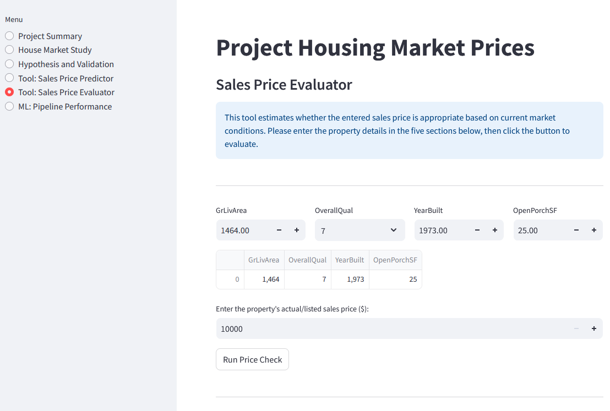
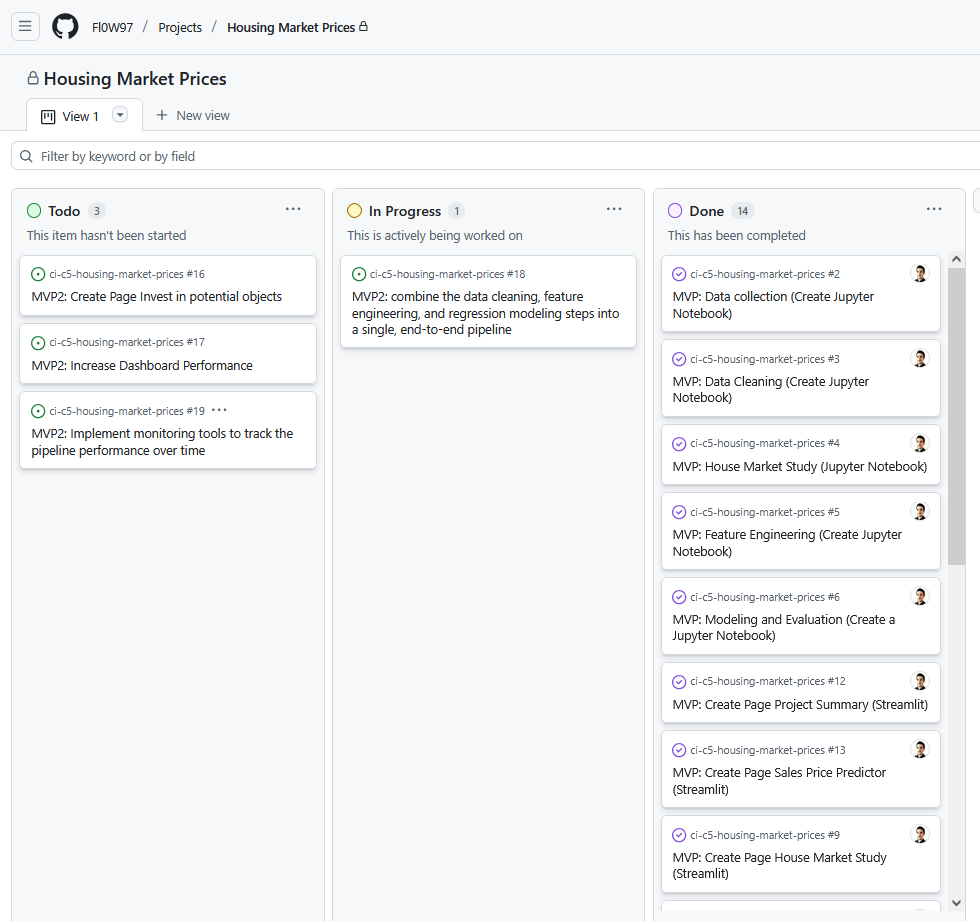

# Housing Market Prices

Welcome to my 5th project [market house pricing](https://analyse-predict-house-market-5a00f7807683.herokuapp.com/). This dashboard contains a house market study and a prediction function for sales prices depending on house features. According to the project requirements and the introduction this dashboard is used by a friend who needs market insights since she is about to sell four inherited houses in Iowa, Ames.

## Dashboard overview / features

### Menu / Navigation

This menu is located on the right side and contains 6 links. It can be hidden. The linked pages are the following ones:

### Quick Project Summary, Page 1

[page_project_summary](app_pages\page_project_summary.py)

This site contains info blocks and a redirection to the README.me file.

### House Market Study, Page 2

[page_house_market_study](app_pages\page_house_market_study.py)

This site contains 3 buttons (checkboxes) and graphics and three information blocks.

### Project Hypothesis and Validation, Page 3

[page_hypothesis_and_validation](app_pages\page_hypothesis_and_validation.py)

This site contains 5 hypothesis with text/info blocks and for each hypothesis there is a graphic to back up the result.
By using the functions ".success" or ".warning" each hypothesis is visually highlighted if it's correct the box appears green, if it's wrong the box appears yellow. This page solves business requirement 1.

### Sales Price Predictor, Page 4

[page_sales_price_predictor](app_pages\page_sales_price_predictor.py)

This site contains info text, a table, 5 widgets/input forms and 5 buttons to predict the sales prices. The button "Run Predictive Analysis" deals with the manual input of the user. The other 4 buttons represent the parameters of the provided 4 inherited houses. This page solves business requirement 2.

### Sales Price Evaluator, Page 5

[page_sales_price_evaluation](app_pages\page_sales_price_evaluation.py)

This site contains info text, a table, 6 widgets/ input forms and 1 button to check if the provided sales price meets the predicted sales price. THis feature helps to validated if the deal is a good one or not.

### ML: Pipeline Perfoormance, Page 6

[page_pipeline_performance](app_pages\page_pipeline_performance.py)

This site provides more detailed information about the two pipelines used within this project. The results of the evalaution are also mentioned (MAE, R² score).

## Project Kanban Board and User Stories

The project scope is defined as a MVP. The main functionalities like presenting graphs and insights of the house market study, adding house features via widgets, as well as providing a predictive sales price, have been set up. The "must-have"-User Stories have been labeld in the GitHub project and all relevant tickets for the projec have the milestone: MVP. Further User Stories have been added along the (MVP) project. The user stories have been defined, and all relevant ones for MVP have been closed. In the column 'MVP2', there are user stories defined for further improvements and extensions after the project submission. A few are in progress. Milestone MVP is created and linked with the relevant stories.

***[Project Kanban Board](https://github.com/users/Fl0W97/projects/4/views/1)***

### User Stories

#### Data Practitioners

|**Story No.**|**Titel**|**User Story**|
|---|---|---|
|[#2](https://github.com/Fl0W97/ci-c5-housing-market-prices/issues/2)|MVP: Data collection (Create Jupyter Notebook)|As Data Practitioner I can access and upload the client's dataset to prepare for next analysis steps.|
|[#3](https://github.com/Fl0W97/ci-c5-housing-market-prices/issues/3)|MVP: Data Cleaning (Create Jupyter Notebook)|As Data Practitioner I preprocess the dataset so that I can continue with the analysis|
|[#4](https://github.com/Fl0W97/ci-c5-housing-market-prices/issues/4)|MVP: House Market Study (Jupyter Notebook)|As Data Practioner I can get an overview about the house market so that I can prepare my next steps for feature Engineering and Modeling|
|[#5](https://github.com/Fl0W97/ci-c5-housing-market-prices/issues/5)|MVP: Feature Engineering (Create Jupyter Notebook)|As a Data Practitioner I get an deep understanding of the dataset and using feature engineering tools so that I can prepare a data pipeline in the next work step.|
|[#6](https://github.com/Fl0W97/ci-c5-housing-market-prices/issues/6)|MVP: Modeling and Evaluation (Create a Jupyter Notebook)|As Data Practitioner I create one or more pipeline models so that I can evaluate and also use the pipelines to meet the business requirement|
|[#8](https://github.com/Fl0W97/ci-c5-housing-market-prices/issues/8)|MVP: Documentation (README.md)|As a Data Practitioner and User I can read through a detailed project description so that I understand what the project is about and what might be adjusted.|
|[#11](https://github.com/Fl0W97/ci-c5-housing-market-prices/issues/11)|MVP: Create Page Pipeline Performance (Streamlit)|As Data Practitioner I can see information (and evaluations) about the used pipelines and their performance so that I understand the process and what happens to get the final predictions.|

#### User / friend

List of User Stories and business requirements to map those to the Data Visualisations and ML tasks which has been accomplish during the project.

|**Business requirement**|**Story No.**|**Titel**|**User Story**|
|---|---|---|---|
|1, 2|[#1](https://github.com/Fl0W97/ci-c5-housing-market-prices/issues/1)|MVP: Project Deployment|As a Site User I can have live access to the dashboard so that I see the information and use functions of the dashboard|
|1, 2|[#7](https://github.com/Fl0W97/ci-c5-housing-market-prices/issues/7)|MVP: Testing Streamlit Dashboard |As a User I want a properly working app so that I can understand the analysis of the house market properly, use the prediction feature and I am not stopped from error messages or failing functions.|
|1, 2|[#8](https://github.com/Fl0W97/ci-c5-housing-market-prices/issues/8)|MVP: Documentation (README.md)|As a Data Practitioner and User I can read through a detailed project description so that I understand what the project is about and what might be adjusted.|
|1|[#9](https://github.com/Fl0W97/ci-c5-housing-market-prices/issues/9)|MVP: Create Page House Market Study (Streamlit)|As User I can see a house market study so that I get an understanding of the house market.|
|1|[#10](https://github.com/Fl0W97/ci-c5-housing-market-prices/issues/10)|MVP: Create Page Hypothesis and Validation (Streamlist)|As User I can read hypothesis and validation approaches so that I understand if the hypothesis are correct or wrong.|
|1|[#12](https://github.com/Fl0W97/ci-c5-housing-market-prices/issues/12)|MVP: Create Page Project Summary (Streamlit)|As User I get an overview of the project so that I can decide if it makes sense to deep dive.|
|2|[#13](https://github.com/Fl0W97/ci-c5-housing-market-prices/issues/13)|MVP: Create Page Sales Price Predictor (Streamlit)|As User I can predict the sale price when I enter certain attributes so that I can define a sales price for my houses.|
|(3) Bonus|[#14](https://github.com/Fl0W97/ci-c5-housing-market-prices/issues/14)|MVP: Create Page Sales Price Evaluator (Streamlit)|As User I can evaluate if the provided sale price is a good deal when I enter certain attributes and a sales price as offer so that I can define a sales price for my houses.|

## (ML) Business case - Step by step

This project closely follows the CRISP-DM (Cross-Industry Standard Process for Data Mining) workflow — a widely adopted framework for structuring data science and machine learning projects. It consists of six iterative phases: Business Understanding, Data Understanding, Data Preparation, Modeling, Evaluation, and Deployment.

Throughout this project, each step maps to the CRISP-DM process. Below, the workflow is broken down into chapters, with examples of how each phase has been addressed. It's important to note that the process is not strictly linear — as shown in the diagram below, the project involved moving back and forth between phases. For example, some decisions made during data cleaning or feature engineering were later revisited and adjusted based on new insights gained in later stages of the workflow.

The primary objective of this project is to develop a machine learning model that can accurately predict the sales price of residential houses based on key property attributes. The main goal is to provide a solution to a friend. However, the tool enables better pricing strategies for sellers, informed purchasing decisions for buyers, and value estimation for real estate platforms or financial institutions.

In the real estate industry, accurate price prediction is critical for:

* Buyers: Making informed decisions on offers.
* Sellers/Agents: Setting competitive and fair prices.
* Lenders: Assessing property value for mortgage approvals.
* Real Estate Portals: Enhancing user experience with price estimations.

### Business Understanding

The first step in the project focuses on developing a solid understanding of the business context and objectives. This includes an initial review of the dataset, which contains 1460 entries and 24 columns with clear and descriptive variable names. While a few columns are missing, the overall structure and content of the data are well-defined. In addition to exploring the data, the business requirements are outlined to ensure alignment with the project's goals. Finally, a set of initial hypotheses was formulated, each accompanied by a brief explanation of how it could be validated through data analysis.

#### Dataset Content

* The dataset is sourced from [Kaggle](https://www.kaggle.com/codeinstitute/housing-prices-data).
* The dataset has almost 1.5 thousand rows and represents housing records from Ames, Iowa, indicating house profile (i.e. Floor Area, Basement, Garage, Kitchen, Lot, Porch, Wood Deck, Year Built) and its respective sale price for houses built between 1872 and 2010.

|**Variable**|**Meaning**|**Units**|
|:----|:----|:----|
|1stFlrSF|First Floor square feet|334 - 4692|
|2ndFlrSF|Second-floor square feet|0 - 2065|
|BedroomAbvGr|Bedrooms above grade (does NOT include basement bedrooms)|0 - 8|
|BsmtExposure|Refers to walkout or garden level walls|Gd: Good Exposure; Av: Average Exposure; Mn: Minimum Exposure; No: No Exposure; None: No Basement|
|BsmtFinType1|Rating of basement finished area|GLQ: Good Living Quarters; ALQ: Average Living Quarters; BLQ: Below Average Living Quarters; Rec: Average Rec Room; LwQ: Low Quality; Unf: Unfinshed; None: No Basement|
|BsmtFinSF1|Type 1 finished square feet|0 - 5644|
|BsmtUnfSF|Unfinished square feet of basement area|0 - 2336|
|TotalBsmtSF|Total square feet of basement area|0 - 6110|
|GarageArea|Size of garage in square feet|0 - 1418|
|GarageFinish|Interior finish of the garage|Fin: Finished; RFn: Rough Finished; Unf: Unfinished; None: No Garage|
|GarageYrBlt|Year garage was built|1900 - 2010|
|GrLivArea|Above grade (ground) living area square feet|334 - 5642|
|KitchenQual|Kitchen quality|Ex: Excellent; Gd: Good; TA: Typical/Average; Fa: Fair; Po: Poor|
|LotArea| Lot size in square feet|1300 - 215245|
|LotFrontage| Linear feet of street connected to property|21 - 313|
|MasVnrArea|Masonry veneer area in square feet|0 - 1600|
|EnclosedPorch|Enclosed porch area in square feet|0 - 286|
|OpenPorchSF|Open porch area in square feet|0 - 547|
|OverallCond|Rates the overall condition of the house|10: Very Excellent; 9: Excellent; 8: Very Good; 7: Good; 6: Above Average; 5: Average; 4: Below Average; 3: Fair; 2: Poor; 1: Very Poor|
|OverallQual|Rates the overall material and finish of the house|10: Very Excellent; 9: Excellent; 8: Very Good; 7: Good; 6: Above Average; 5: Average; 4: Below Average; 3: Fair; 2: Poor; 1: Very Poor|
|WoodDeckSF|Wood deck area in square feet|0 - 736|
|YearBuilt|Original construction date|1872 - 2010|
|YearRemodAdd|Remodel date (same as construction date if no remodelling or additions)|1950 - 2010|
|SalePrice|Sale Price|34900 - 755000|

#### Business Requirements

My friend received an inheritance from a deceased great-grandfather located in Ames, Iowa, to  help in maximising the sales price for the inherited properties.

Although my friend has an excellent understanding of property prices in her own state and residential area, she fears that basing her estimates for property worth on her current knowledge might lead to inaccurate appraisals. What makes a house desirable and valuable where she comes from might not be the same in Ames, Iowa. She found a public dataset with house prices for Ames, Iowa, and will provide you with that.

* 1 - The client is interested in discovering how the house attributes correlate with the sale price. Therefore, the client expects data visualisations of the correlated variables against the sale price to show that.

* 2 - The client is interested in predicting the house sale price from her four inherited houses and any other house in Ames, Iowa.

### Data collection

Jupyter nootebook: [01_data_collection](jupyter_notebooks/01_data_collection.ipynb)

The original dataset is downloaded from kaggle.com and provided by Code Institute, [Link details](https://www.kaggle.com/datasets/codeinstitute/housing-prices-data). It is unzipped and loaded into the project folder 'input'. There are three data files: One dataset contains the four inherited houses where the sales price should be defined, one file contains the metadata explanation and the last one "house_prices_records.csv" is the main dataset which is handled within this project, it contains variables.
By using pandas a DataFrame is defined and an initial inspection is performed to understand its structure, dimensions, and content (Load and inspect the Kaggle dataset).There are 1460 entries, 0 to 1459, and 24 data columns. Data types of all columns are reviewed to distinguish between numerical and non-numerical features, which is essential for preprocessing and model selection.

**The following parameter do not have a numeric type:**

[BsmtExposure', 'BsmtFinType1', 'GarageFinish', 'KitchenQual'], dtype='object'.

In addition, the dataset is analyzed to detect columns with missing values. The number of missing entries per column is calculated and presented in descending order to highlight areas requiring attention.

**The following columns have missing Values:**

['EnclosedPorch', 'WoodDeckSF', 'LotFrontage ', 'GarageFinish', 'BsmtFinType1', 'BedroomAbvGr', '2ndFlrSF', 'GarageYrBlt', 'BsmtExposure', 'MasVnrArea']

Last but not least, columns containing zero values are identified and evaluated. The total number of zero values in the dataset is reported, along with a breakdown per column, to assess if zeros may represent missing or invalid data. What is suprising is the fact that the columns 'EnclosedPorch' and 'WoodDeckSF' have a hughe number of missing values, therefore, those variables are not considered for the further analysis.

**The following columns have the value zero:**

['MasVnrArea', '2ndFlrSF', 'openPorchSF', 'BsmtFinSF1', 'BsmtUnfSF', 'EnclosedPorch', 'GarageArea', 'WoodDeckSF', 'TotalBsmtSF', 'BedroomAbvGr']

All values should remain, since it is an indication that the relevant attribute is not available.

***Code details***

|**Code snippet**|**library**|**Comment**|
|---|---|---|
| `df.info()` | pandas | Provides dataset df information |
| `df.isnull()` | pandas | identifies missing values in the dataset df |
| `os.makedirs(name='outputs/data_collected')` | os | creates a folder in repo |

### Data cleaning

Jupyter notebook: [02_data_cleaning](jupyter_notebooks/02_data_cleaning.ipynb)

The data cleaning phase focus on preparing the dataset for analysis and modeling by improving its quality and consistency. This included handling missing values and correcting incorrect data types. Outliers that could distort model performance haven't been identified. A correlation matrix was created to better understand relationships between features and identify potential issues such as multicollinearity. After cleaning, the dataset was split into training and test sets to support proper model validation. All cleaned and prepared data, along with relevant scripts and notebooks, was versioned and pushed to the repository 'outputs/data_cleaned/...'.

#### Handling missing values

a. Dropping Columns:
Columns with a high proportion of missing data — such as EnclosedPorch, WoodDeckSF, and LotFrontage (with 259 missing values) — are better dropped entirely due to limited usability.

b. Imputing Missing Values:
For columns with a moderate number of missing entries, imputation is a suitable approach, and the method used depends on the type of data:

* Numeric columns: For '2ndFlrSF', 'BedroomAbvGr', 'LotFrontage', 'GarageYrBlt' the mean, median, or mode is used, depending on data distribution.
* Categorical columns: For 'BsmtExposure', 'BsmtFinType1', 'GarageFinish' missing values are filled in using the mode (most frequent value).
* The Column with minimal missing values (MasVnrArea, only 8 missing) is imputed with the mean mode.

Special case – GarageYrBlt (81 missing): Simple imputation (mean/mode) isn't ideal here. A better strategy might involve group-based imputation or predictive modeling. However, since this column will be removed later, no imputation is performed.

c. Filling with Specific Values:
For certain categorical fields, missing values can be replaced with a placeholder like 'None' or 'Unknown', especially when that makes logical sense in the dataset context.

***Code details***

|**Code snippet**|**library**|**Comment**|
|---|---|---|
| `df.drop(columns=['column_name', 'column_name'])` | pandas | Is used to drop columns |
| `df['column_name'].fillna(df['column_name'].median())` | pandas | Is used to impute values by using the median value |
| `df['column_name'].fillna(df['column_name'].mean())` | pandas | Is used to impute values by using the mean value |

#### Correcting incorrect data types

In the provided dataset there are the following four variables which don't have numeric values.

* `BsmtExposure`
* `BsmtFinType1`
* `GarageFinish`
* `KitchenQual`

For further analysing steps and for the pipeline processing it is mandatory to transfrom those to numeric values. That is done with 'astype(str)'.

1. Convert the columns to string type (it will handle NaN as 'nan' string)
2. Strip any leading/trailing whitespace from the column values
3. Replace string representation of 'NaN' with 'Unknown'
4. Map categorical values to numeric
5. Check the unique values to confirm that the columns contain only valid values
6. Apply numeric conversion safely (handle non-numeric values)

***Code details***

|**Code snippet**|**library**|**Comment**|
|---|---|---|
| `df.info() | pandas | Provides information about range index, Non-Null Count, Dtypes |
| `df['column_name'].asype(str)` | pandas | Converts a column to string data type.|
| `df['column_name'].str.strip()` | pandas | Removes leading and trailing whitespace from string values in a column. |
| `df['column_name'].replace("nan", "Unknown")` | pandas | Replace string representation and map categorical values to numeric.|
| `pd.to_numeric(df['column_name'], errors='coerce')` | pandas | Converts column values to numeric (int or float). Invalid parsing will raise an error unless you pass errors='coerce'.|

#### Handling zeros in the dataset

Columns with Missing Values and Their Counts:
EnclosedPorch    1324
WoodDeckSF       1305
LotFrontage       259
GarageFinish      235
BsmtFinType1      145
BedroomAbvGr       99
2ndFlrSF           86
GarageYrBlt        81
BsmtExposure       38
MasVnrArea          8
dtype: int64

The analysis shows that there are zeros in the dataset. Total Missing Values in the Dataset: 3580. Whether those should be transformed depends on:

* The nature of the feature (binary, categorical, or continuous).
* The interpretation of zeros (absence vs. a true zero value).
* The impact of zeros on the target variable (do they have predictive power?).

The zeros represent absence of a feature (e.g., 2ndFlBsmt is a binary flag indicating the presence of a second-floor basement). There are two opitons: A - creating additional features (like a binary indicator for zero values) or B - leave them as-is. I decided to leave them as-is since the zeros show that a certain feature is not available. Currently a categorical approach by identifiying yes or no of a feature is not part of the analysis.

#### Correlation matrix

The correlation gives an early insight into data quality, structure, and relationships, helping to clean and shape the data more effectively for modeling. It becomes clear that the highes correlations with 'SalePrice' are 'OverallQual' and 'GrLivArea'.
In addition, it shows that there are 13 columns that contains varibales with a medium correlation between 0.3 and 0.7 and there are 6 columns with a correlation lower than 03.

***High Correlation: Correlation coefficient >0.7***

* OverallQual      0.790982
* GrLivArea        0.708624

***Medium Correlation: Correlation coefficient [0.3,0.7]***

* KitchenQual      0.659600
* GarageArea       0.623431
* TotalBsmtSF      0.613581
* 1stFlrSF         0.605852
* YearBuilt        0.522897
* YearRemodAdd     0.507101
* MasVnrArea       0.477493
* GarageYrBlt      0.466754
* GarageFinish     0.465039
* BsmtFinSF1       0.386420
* LotFrontage      0.334771
* OpenPorchSF      0.315856
* 2ndFlrSF         0.312479

***Low Correlation: Correlation coefficient <0.3***

* LotArea          0.263843
* BsmtFinType1     0.261373
* BsmtExposure     0.229632
* BsmtUnfSF        0.214479
* BedroomAbvGr     0.155784
* OverallCond     -0.077856

***Code details***

|Code snippet|library|Comment|
|---|---|---|
| `correlation_matrix = df.corr()`| pandas | create a correlation matrix |
| `correlation_matrix['SalePrice'].sort_values(ascending=False)` | pandas | focusing on SalesPrice correlations and sort |
| `plt.figure(), plt.title(), plt.show() | matplotlib.pyplot` | create a graphic |
| `sns.heatmap(correlation_matrix, annot=True, fmt=".2f", cmap="coolwarm", cbar=True)` | seaborn | create a graphic/heatmap |

#### Split into training and test sets

The split into trianing and test data is processed a few times wihtin this project. Both datasets are mandatory to apply a ML pipleline. It is a preparation for the next chapters.

***Code details***

|**Code snippet**|**library**|**Comment**|
|---|---|---|
| `os.makedirs(name='...')` | os | Create a directory (e.g., for saving train/test sets); exist_ok=True avoids errors if the folder already exists. |
| `TrainSet, TestSet = train_test_split(df, test_size=0.3, random_state=42)` | sklearn.model_selection | Split the DataFrame into training and testing sets using a 70/30 ratio. |
| `TestSet.to_csv("outputs/data_cleaned/TestSet.csv", index=False)` | pandas | 	Save the test set as a CSV file without the index column. |
| `TrainSet.to_csv("outputs/data_cleaned/TestSet.csv", index=False)` | pandas | Save the train set as a CSV file without the index column. |

### House Market Study

This study explores the key drivers of house prices within the dataset by validating five initial hypotheses using statistical correlation, visual inspection, and distributional comparisons. The dataset includes homes with sale prices ranging from $34,900 to $755,000, with a median sale price of $163,000 and a mean of $180,921. This indicates a slightly right-skewed distribution, with a few high-end properties pulling the average upward. The most houses has been sold in the price range between $150,000 and $250,000.

* The housing market appears to reward size (GrLivArea) more consistently than other features.
* High-end properties, while fewer in number, significantly impact the mean price, suggesting a right-skewed market.
* Features like bedroom count or overall condition alone are not strong indicators of price — buyers seem more influenced by total living space and renovation status.
* Renovation and newer construction positively affect sale price, though with moderate strength.
* Applying log transformation to SalePrice was effective in reducing the influence of outliers and improving model performance.
* Focus on GrLivArea, YearBuilt for modeling or predictive pricing.

#### Hypothesis and how to validate

Jupyter notebook: [02b_house_market_study](jupyter_notebooks/02b_house_market_study.ipynb)

There are five hypothesis generated at the beginning of the project. In the following you see each hypothesis, the result and how it has been validated.

##### Hypothesis (H1): Larger square footage often correlates with higher sales prices. (Correct.)

The first hypothesis suggests that houses with larger living areas tend to have higher sales prices. To validate this, we examined the correlation between square footage and sale price. The results confirmed a strong positive correlation, with larger homes generally commanding higher prices. The distribution between GrLivArea and SalePrice indicates it as well. For instance, GrLivArea of 1,000 SF are mostly sold for $60,000 to 150,000, GrLivArea of 1,500 SF is sold for $90,000 to $220,000 and for 2,000 SF the price range just starts at $140,000 and goes up to $400,000. However, after 2,100 SF the correlation gets weak.

* Analyse the dataset and provide a correlation analysis about sales price.
* Plot a distribution of price vs square_footage. To separate both of these variables.

Validation:
See correlation analysis. The Correlation value GrLivArea/SalePrice is high (0.71)
[02_data_cleaning: Correlation analysis](jupyter_notebooks/02b_house_market_study.ipynb)

[02b_house_market_study: Distribution of GrLivArea by SalePrice](jupyter_notebooks/02b_house_market_study.ipynb)

##### Hypothesis (H2): More bedrooms, higher sales price. (Wrong.)

This hypothesis posits that houses with more bedrooms should fetch higher prices. Upon further analysis, however, the correlation between the number of bedrooms and sale price was weak, suggesting that the number of bedrooms alone is not a significant predictor of price in this market. The distribution shows that a house with four bedrooms is availabe in nearly each price category from $50,000 to even $745,000. 

* Analyse the dataset and provide a correlation analysis about sales price.
* Use boxplots or plot of price vs number of bedrooms to compare average prices across different numbers of bedrooms.

Validation:
See correlation analysis above. The Correlation value BedroomAbvGr/SalePrice is very low (0.16)

[02b_house_market_study: Distribution of Bedroomabvgr by SalePrice](jupyter_notebooks/02b_house_market_study.ipynb)

##### Hypothesis (H3): Better OverallCond, higher sales price. (Wrong.)

The third hypothesis proposed that homes in better overall condition would be sold at higher prices. However, the analysis showed a very weak negative correlation, indicating that overall condition had little to no effect on the sales price in this dataset. The distribution supports that. The overall condition category 5 is availabe for the whole price range from $40,000 to $745,000. There are relatively cheap house ($120,000) availabe for the overall condition category 9.

* Analyse the dataset and provide a correlation analysis about sales price.
* Use boxplots or plot of price vs overall condition to compare average prices across categories of overall condition.

Validation:
See correlation analysis above. The Correlation value OverallCond/SalePrice is very low (-0.078)

[02b_house_market_study: Distribution of OverallCond by SalePrice](jupyter_notebooks/02b_house_market_study.ipynb)

##### Hypothesis (H4): Renovated old houses sell for more than non-renovated old houses (Wrong.)

Here, we hypothesized that houses that have been recently renovated would sell for a higher price. The results revealed a moderate correlation, with renovated houses tending to have higher prices. In the comparison graphic you see that the avarage price of both renovated and non renovated houses is similar around $130,000. A few more renovated houses seem to have a higher SalePrice. However, though the effect was not as strong as initially expected. During the analysis there was a split between renovated and non-renovated houses that leads to a new temporary feature "IsRenovated". Furthermore, it has been considered to isolate the effect of renovations by comparing renovated and non-renovated homes with similar characteristics—such as size, quality, and age. A OLS Regression has been applied. The results (p = 0.8871, p > 0.05) indicating that there is no statistically significant difference.

Let’s compare apples to apples

* Compare average prices of renovated vs not renovated homes.
* Check if the year of renovation is recent, and see if it correlates with price increase.
* Apply statistical test: t-test (compare p-value)

Validation:
See correlation analysis above. The Correlation value YearRemodadd/SalePrice is medium (0.51)

[02b_house_market_study: Comparison_of_old_houses_renovated_vs_not_renovated](jupyter_notebooks/02b_house_market_study.ipynb)

##### Hypothesis (H5): Newer houses are more expensive (Correct.)

The final hypothesis suggests that newer houses are more expensive than older ones. Our findings supported this hypothesis to some extent, with a moderate correlation observed between the year of construction and sale price, though other factors also played a significant role in determining the price. Here the comparison of the average sales price shows a significant difference. newer houses which are build after 2000 are sold for more ($195,000) then old houses ($180,000). According to the OLS regression (p = 0.0123, p < 0.05), there's a statistically significant difference.

* Compare average prices of new vs old houses.
* Run correlation and scatterplots, or use regression analysis.
* Apply control for confounding. Compare houses of similar characteristics (e.g., same GrLivArea, OverallQual, etc.), only differing in YearBuilt.
* Apply statistical test: t-test (compare p-value)

Validation:
See correlation analysis above. The Correlation value year_built/SalePrice is medium (0.52)

[02b_house_market_study: Comparison_of_sale_price_new_vs_old_houses](jupyter_notebooks/02b_house_market_study.ipynb)

### Feature Engineering

Jupyter notebook: [03_featureEngineering](jupyter_notebooks\03_featureEngineering.ipynb)

Durign the feature Engineering process different tools has been used such as ydata profiling reports and different transformers (categroical encoding, numerical Transformation and SmartCorrelation).

#### YData Profiling Report

The report enables to have a closer look at each variable. The following insighs are noticeable:

|**Variable**|**Comment**|
|--|--|
| 2stFlrSF | ~59% zeros, only 41% of the houses have a 2st floor |
| BsmtFinSF1 | 32% of the houses don't have a basement |
| GarageArea | 94% of the houses have a garage, it seems a garage is not a convenient, but mandatory attribute in the market. If a garage is finished or unfinished is not correlating with sales price. |
| TotalBsmtSF | THere are only 2,5% of the houses which don't have a basement. It seems a basement is a mandatory attribute. |
| YearBuilt | A big amount of houses in the dataset has been built around 2000. It seems there are a lot new houses in the market. |
| YearRemodAdd | A noticable amount of houses has been renovated around 2000. |

***Code details***

|**Code snippet**|**library**|**Comment**|
|---|---|---|
| `from ydata_profiling import ProfileReport` `pandas_report = ProfileReport(df=TrainSet, minimal=True)` `pandas_report.to_notebook_iframe()`| ydata_profiling, pandas | This code imports the ProfileReport class from the ydata_profiling library, which is used to generate an interactive data profiling report for the given dataset (TrainSet). The minimal=True argument generates a simplified version of the report. Finally, to_notebook_iframe() renders the report in a Jupyter Notebook as an iframe, making it interactive within the notebook. |

#### 1. Categorical Encoding

Categorical variables represent discrete categories. Machine learning models generally require numeric inputs, so categorical variables must be encoded into a numerical form. For the convertion the Label Encoding has been applied. It assigns each category a unique integer.

In the jupyter notebook '02_data cleaning'. The following parameters has been transformed (for correlation analysis): 'BsmtExposure', 'BsmtFinType1' and 'GarageFinish'.
In jupyter notebook '04_modeling_and_evaluation'. The following parameters has been transformed (for pipeline model): (...).

***Code details***

|**Code snippet**|**library**|**Comment**|
|---|---|---|
| `from feature_engine.encoding import OrdinalEncoder` `def FeatEngineering_CategoricalEncoder(df_feat_eng, column):` `list_methods_worked = []` `try:` `encoder = OrdinalEncoder(encoding_method='arbitrary', variables=[` `f"{column}_ordinal_encoder"])` `df_feat_eng = encoder.fit_transform(df_feat_eng)` `list_methods_worked.append(f"{column}_ordinal_encoder")` `except Exception:` `df_feat_eng.drop([f"{column}_ordinal_encoder"], axis=1, inplace=True)` `return df_feat_eng, list_methods_worked` | feature_engine | This code defines a function to perform ordinal encoding on a specified categorical column of a DataFrame (`df_feat_eng`). It uses the `OrdinalEncoder` from the `feature_engine` library to convert categories into numeric values based on an arbitrary encoding method. If the encoding is successful, the column is added to the DataFrame, and the method is logged. If an error occurs, the new column is dropped. The function returns the modified DataFrame and a list of methods applied. |

#### 2. Numerical Transformation

Numerical features often need to be transformed to improve model performance, especially if their distribution is skewed.
Common Transformation Techniques:

* Normalization: Scaling the values to a range, typically between 0 and 1.
* Standardization: Scaling the values to have a mean of 0 and a standard deviation of 1.
* Log Transformation: Helps with highly skewed data by compressing the range.

Within this project the log transformation is done for 'SalePrice' and 'GarageArea' since their distribution is skewed.

The graphics show the improvement of the distribution by using log10:

***Code details***

| **Code snippet** | **Library** | **Comment** |
|------------------|-------------|------------|
| `from feature_engine import transformation as vt` `def FeatEngineering_Numerical(df_feat_eng, column):` `list_methods_worked = []` `# LogTransformer base 10` `try:` `lt = vt.LogTransformer(variables=[f"{column}_log_10"], base='10')` `df_feat_eng = lt.fit_transform(df_feat_eng)` `list_methods_worked.append(f"{column}_log_10")` `except Exception:` `df_feat_eng.drop([f"{column}_log_10"], axis=1, inplace=True)` `...` | feature_engine | This code defines a function to apply a base-10 log transformation on a specified numerical column of a DataFrame (`df_feat_eng`). The `LogTransformer` from the `feature_engine` library is used to perform the transformation, which can help in normalizing skewed data by compressing high values. If the transformation is successful, the log-transformed column is added to the DataFrame, and the method is logged. If an error occurs, the new column is dropped. |
| `TrainSet['column_name'] = np.log10(TrainSet['column_name'])` `TestSet['column_name'] = np.log10(TestSet['column_name'])` | numpy, pandas | This code applies a log transformation with base 10 to the relevant column of both the training set (`TrainSet`) and the test set (`TestSet`). The transformation helps compress the high values, making the distribution more symmetric and reducing the impact of extreme values. The result is that both datasets now have log-transformed values, which can improve model performance by handling skewed data. |

Similar like the code above further transformer are applied and tested: LogTransformer base e, ReciprocalTransformer, PowerTransformer, BoxCoxTransformer, YeoJohnsonTransformer.

#### 3. Smart Correlation Selection

In a dataset, some features may be highly correlated with others. Keeping highly correlated features in a model can lead to multicollinearity, which can negatively impact model performance.
Method to Select Features Based on Correlation:

* Correlation Matrix: You can compute the correlation matrix to find highly correlated pairs.
* Threshold-based Feature Removal: Remove features that have a correlation higher than a certain threshold, e.g., 0.8 or -0.8.

Based on the correlation analysis for salePrice and further interpretation of the context the following parameters will be ignored:
'TotalBsmtSF', '1stFlrSF', 'YearRemodAdd', 'GarageYrBlt', 'MasVnrArea', 'BsmtFinSF1', '2ndFlrSF'.

The further features are intensivley analyzed during the Smart Correlation Selection Analysis:

| Feature     | Explanation | Action |
|-------------|-------------|--------|
| 1stFlrSF | It is likely correlated with features like GrLivArea (total above-ground living area) or TotalBsmtSF (basement area). Including all of them could introduce redundancy. | Drop this feature to avoid multicollinearity. Keep GrLivArea instead, as it is likely more informative. |
| GrLivArea | It’s a strong indicator of house size and price. Highly correlated with 1stFlrSF, TotalBsmtSF, TotalArea, and possibly 2ndFlrSF. | Keep this feature. Drop 2ndFlrSF to simplify the model and reduce multicollinearity. |
| SalePrice | This is the log-transformed target variable. Highly correlated with GarageArea. Since it’s the dependent variable we aim to predict, it must not be used as a predictor. | Keep in train/test sets for modeling. Drop GarageArea to avoid leakage, as it is strongly correlated with the target. |
| OverallQual | Highly correlated with KitchenQual and YearBuilt. Considered more informative than specific features like KitchenQual. Shows highest correlation with SalePrice in correlation analysis. | Keep OverallQual and also keep YearBuilt. |
| KitchenQual | Overlaps with OverallQual. Retaining both could create redundancy. | Drop KitchenQual, as OverallQual likely captures this aspect already. |

***Code details***

| **Code snippet** | **Library** | **Comment** |
|------------------|-------------|------------|
| `from feature_engine.selection import SmartCorrelatedSelection` `corr_sel = SmartCorrelatedSelection(variables=None, method="spearman", threshold=0.6, selection_method="variance")` `corr_sel.fit_transform(df_engineering)` `corr_sel.correlated_feature_sets_` | feature_engine | This code imports the `SmartCorrelatedSelection` class from the `feature_engine` library. It initializes an object `corr_sel` with specific parameters to select correlated features from a DataFrame. The method uses the Spearman correlation and a threshold of 0.6 to identify features that are highly correlated. The `fit_transform()` function fits the model to the data and transforms the input DataFrame by removing correlated features based on the specified threshold. The `correlated_feature_sets_` attribute holds the sets of correlated features identified by the method. |
| `corr_sel.features_to_drop_` | feature_engine | This line retrieves the list of features that should be dropped based on the correlation analysis. The `features_to_drop_` attribute of the `SmartCorrelatedSelection` object contains the names of features that have been identified as highly correlated with others and are removed from the dataset. This helps reduce multicollinearity and improves model performance by removing redundant information. |

#### 4. Discretization (Binning) - not applied

Discretization (or binning) is the process of transforming continuous variables into categorical ones. This is useful if you want to reduce the impact of outliers or make certain trends more interpretable. This method could have been used for the house market study. For the new category old/new houses. However, for the pipeline binning is not relevant, as a consequence it hasn't been used during the Feature Engineering process.

#### 5. Outlier Detection and Treatment - not applied

Outliers can negatively impact model performance by skewing results and leading to inaccurate predictions. A common technique for detecting outliers is the Interquartile Range (IQR) method, which identifies outliers as data points falling outside of 1.5 times the IQR from the first or third quartile.

Although this method is effective, in this case, the outliers in the SalePrice column represent genuine, high-value property sales. These data points are not errors but valid examples of high-end properties. Removing them would limit the model’s ability to generalize across the full range of property values, especially for future predictions involving expensive homes (e.g., properties priced at $1,000,000 or more).

To address the skewness introduced by these extreme values, a log transformation was applied to the SalePrice variable. This transformation compresses the range of high values, resulting in a more symmetric distribution and reducing the influence of outliers. As a result, after the transformation, the data no longer contains extreme values that exceed the IQR threshold, and no additional outlier treatment is necessary.

#### Feature Engineering Spreadsheet summary

|**Variables**|**Comment**| **Correlation with SalePrice**|**Potential Feature Engineering Transformers**|
|---------|-------|---------------------------|------------------------------------------|
| SalePrice| Target variable; log-transformed to normalize skewness| 1.00| Numerical Transformation (log)|
| EnclosedPorch| Dropped during data cleaning process due to low correlation and high amount of missing values| 0.13| None|
| WoodDeckSF| Dropped during data cleaning process due to low correlation and high amount of missing values| 0.32| None|
| BsmtFinType1| Dropped during data cleaning process due to low correlation| 0.26| CategoricalImputer|
| LotArea| Dropped during data cleaning process due to low correlation| 0.26| None|
| BsmtFinSF1| Dropped during data cleaning process due to low correlation| 0.39| None|
| BsmtUnfSF| Dropped during data cleaning process due to low correlation| 0.21| None|
| LotFrontage| Dropped during data cleaning process due to low correlation| 0.35| MeanMedianImputer|
| BsmtExposure| Categorical values, Dropped during data cleaning process, after house market study, due to low correlation| 0.12| CategoricalImputer|
| BedroomAbvGr| Dropped during data cleaning process, after house market study, due to low correlation, analysis for BedroomAbvGr done| 0.17| MeanMedianImputer|
| OverallCond| Dropped during data cleaning process, after house market study, due to low correlation, analysis for CverallCond done| 0.08| None|
| 1stFlrSF| Highly correlated with TotalBsmtSF; dropped during Smart Correlated Selection| 0.61| None|
| 2ndFlrSF| Missing values filled using median(), dropped during Smart Correlated Selection| 0.32| MeanMedianImputer|
| GarageYrBlt| Highly correlated with YearBuilt dropped during Smart Correlated Selection| 0.49| MeanMedianImputer, SmartCorrelatedSelection|
| KitchenQual| Categorical; encoded using OrdinalEncoder; removed during Smart Correlated Selection| 0.51| OrdinalEncoder|
| YearRemodAdd| Closely related to YearBuilt, removed during Smart Correlated Selection | 0.51| SmartCorrelatedSelection|
| TotalBsmtSF| Highly correlated with 1stFlrSF; removed during Smart Correlated Selection| 0.61| SmartCorrelatedSelection|
| GarageArea| Highly correlated with GrLivArea; removed during Smart Correlated Selection| 0.62| None|
| GarageFinish| Categorical; imputed with most frequent value; encoded using OrdinalEncoder, removed during Smart Correlated Selection | 0.55| CategoricalImputer, OrdinalEncoder|
| MasVnrArea| Imputed with mean values; dropped after feature importance analysis| 0.48| MeanMedianImputer|
| **OpenPorchSF**| retained in final features after feature importance analysis| 0.32| Dropped|
| **YearBuilt**| closely related to YearRemodAdd, retained in final features| 0.52| None|
| **OverallQual**| Strongly correlated with target; retained in final features| 0.79| None|
| **GrLivArea**| Log-transformed due to skewness; retained in final features| 0.71| Numerical Transformation (log)|

### Modeling

Jupyter notebook: [04_modeling_and_evaluation_regression](jupyter_notebooks\04_modeling_and_evaluation_regression.ipynb)

A regression model was used in this project because the target variable—house sale price—is a continuous numerical value, not a category or group. It scales the data, selects features using model's feature importance and fits the model on the selected, scaled features.

Classification models are designed for predicting discrete classes (e.g., “high” vs. “low” price range), while clustering models group similar data points without using a labeled target. Since the goal is to predict the exact sale price based on property features, regression is the appropriate and most effective approach.

#### Data Cleaning and Feature Engineering pipeline (Data Preprocessing Pipeline)

A comprehensive data cleaning and transformation pipeline was implemented using the **scikit-learn** and **feature-engine** libraries. 

* **Step 1: The process begins by loading the data from the "collected_data" folder.**

* **Step 2: Data Cleaning and Feature Engineering**

The first machine learning pipeline focuses on preprocessing the data and includes the following transformers:

* **DropUnwantedFeatures**: Removes unnecessary columns (defined separately in preprocessing.py)
* **ImputeMasVnrArea**: Fills missing values in the `MasVnrArea` column.
* **ImputeGarageFinish**: Fills missing values in the `GarageFinish` column.
* **OrdinalCategoricalEncoder**: Encodes ordinal categorical features.
* **SmartCorrelatedSelection**: Selects relevant features based on correlation analysis.
* **LogTransformation**: Applies a log10 transformation to the `GrLivArea` feature.

This pipeline is applied to the dataset, resulting in a transformed DataFrame (`df_transformed`).

* **Train-Test Split and Target Transformation**

After preprocessing, the target variable, `SalePrice`, is transformed using the log10 scale to ensure consistency across both the training and test datasets. The transformed target variable is then split into training and testing sets:

* ***X_train*** and ***y_train*** are used for model training.
* ***X_test*** and ***y_test*** are reserved for model evaluation.

The feature set (`X`) excludes the target variable `SalePrice`. Following the transformation, the target variable’s distribution is checked for imbalance. As the `SalePrice` variable was log-transformed, no further adjustments are necessary, as the distribution is well-balanced.

***Code details***

| **Code snippet** | **Library** | **Comment** |
|------------------|-------------|-------------|
| `from feature_engine.selection import SmartCorrelatedSelection` | feature_engine | Imports class to detect and remove highly correlated features to reduce multicollinearity. |
| `from feature_engine.encoding import OrdinalEncoder` | feature_engine | Encodes categorical variables using arbitrary integers. Useful for tree-based models. |
| `from feature_engine.transformation import LogTransformer` | feature_engine | Applies logarithmic transformation to reduce skewness in numeric features. |
| `from feature_engine.imputation import MeanMedianImputer, CategoricalImputer` | feature_engine | Imputes missing values using mean/median for numeric and mode for categorical variables. |
| `from src.preprocessing import drop_unwanted_columns` | custom module | Imports user-defined function to remove low-value or irrelevant columns from the dataset. |
| `class HyperparameterOptimizationSearch:` | custom code | Custom class to perform hyperparameter tuning and model evaluation across multiple algorithms. |
| `y_log = np.log10(df['SalePrice'])` | numpy, pandas | Log-transforms target variable to stabilize variance and handle outliers. |
| `X_train, X_test, y_train, y_test = train_test_split(X, y_log, test_size=0.2, random_state=0)` | sklearn | Splits the dataset into training and testing sets, using the transformed target. |
| `pipeline = PipelineDataCleaningAndFeatureEngineering()` `X_train = pipeline.fit_transform(X_train)` `X_test = pipeline.transform(X_test)` | sklearn (custom pipeline) | Applies preprocessing pipeline to both training and test data, ensuring consistent transformations. |
| `plt.figure(figsize=(10, 6))` `sns.histplot(y_train, bins=40, kde=True, color='skyblue')` `plt.axvline(y_train.mean(), color='red', linestyle='--', label=f'Mean: ${y_train.mean():,.0f}')` `plt.axvline(y_train.median(), color='green', linestyle='--', label=f'Median: ${y_train.median():,.0f}')` `plt.title("Distribution of Sale Prices in Training Set")` `plt.xlabel("SalePrice")` `plt.ylabel("Frequency")` `plt.legend()` `plt.show()` | matplotlib, seaborn | Visualizes the distribution of the `SalePrice` in the training set, highlighting mean and median. |

#### Regression pipeline

* **Step2b: Set up ML pipeline for regression modeling and predicting the sales price**
The second pipeline focuses on regression modeling and sales price prediction. The key steps are as follows:

* **Hyperparameter Optimization**: A search for the best model and hyperparameters is conducted. Multiple regression algorithms, including ExtraTreesRegressor, GradientBoostingRegressor, and others, are evaluated. Among the algorithms tested, ExtraTreesRegressor provided the best performance.

* **Multiple Regression Models**: Several regression models were trained and evaluated with hyperparameter optimization using GridSearchCV. 

The results of the tests show that ExtraTreesRegressor is the best algorithm for this approach:

* **Hyperparameter Tuning for ExtraTreesRegressor**: Several hyperparameters for the ExtraTreesRegressor were tested to identify the optimal configuration. The hyperparameters were defined using the `params_quick_search` method.

The result show that the best hyperparameter set ups for the defined algorithm are 274, 301, 58, 31 with mean_score -0.053359

* **Step 3 Model Selection**: After the optimization process, the best-performing model and corresponding hyperparameters were selected based on the valuation results.

* **Model Evaluation**: Predictions were made using the trained model, and performance was evaluated using various metrics. A visual comparison of the actual vs. predicted sales prices was generated. Different scoring methods, such as `neg_mean_absolute_error` and `r2`, were used to assess the pipeline's overall effectiveness.

* **Feature Importance**: The most important features contributing to the model's predictions were identified. The top features in terms of importance were:
* `OverallQual`
* `GrLivArea`
* `YearBuilt`

***Code details***

| **Code snippet** | **Library** | **Comment** |
|------------------|-------------|-------------|
| `models_quick_search = { ... }` `params_quick_search = { ... }` | sklearn, xgboost | Defines multiple regression models (e.g., `XGBRegressor`, `RandomForestRegressor`) with default or empty hyperparameters for later comparison and tuning. Useful for quick model testing. |
| `search = HyperparameterOptimizationSearch(models=models_quick_search, params=params_quick_search)` `search.fit(X_train, y_train, scoring='neg_mean_absolute_error', n_jobs=-1, cv=5)` `search.score_summary(sort_by='mean_score')` | custom/extended sklearn (possibly from `mlxtend` or a custom wrapper) | Runs a hyperparameter optimization search over defined models using cross-validation and a scoring metric (negative MAE). Summarizes performance for comparison. |
| `model = ExtraTreesRegressor(n_estimators=100, random_state=42)` `model.fit(X_train, y_train)` | sklearn | Initializes and fits an `ExtraTreesRegressor` on the training data. A fast and accurate ensemble method useful for feature importance and prediction. |
| `models_quick_search = {"ExtraTreesRegressor": ExtraTreesRegressor(random_state=0)}` `params_quick_search = { "ExtraTreesRegressor": { "model__n_estimators": [100, 200], "model__max_depth": [None, 20], "model__min_samples_split": [2, 5] }}` | sklearn | Sets up model and grid of hyperparameters for `ExtraTreesRegressor` to be used in grid search or tuning, allowing exploration of different configurations. |
| `df_feature_importance = (pd.DataFrame(data={ 'Feature': X_train.columns[feat_selector.get_support()], 'Importance': model.feature_importances_})` `.sort_values(by='Importance', ascending=False)` | pandas, sklearn | Creates a DataFrame to display feature importance values from the trained model. |
| `best_features = df_feature_importance['Feature'].to_list()` | pandas | Extracts the list of important features based on their importance scores. |
| `df_feature_importance.plot(kind='bar', x='Feature', y='Importance')` | pandas, matplotlib | Plots a bar chart of feature importance for visual analysis. |

#### Feature Refinement

In this step, the pipeline is refined by evaluating additional features. The primary objective is to determine whether the three most important features (`OverallQual`, `GrLivArea`, and `YearBuilt`) alone provide the best results, or if adding one or two more features can enhance the model's performance.

* **Feature Evaluation**: Several feature combinations were tested to identify the optimal feature set for the model. The focus was on whether adding features beyond the top three most important ones would result in better predictive performance. Considered have been both the Mean Absolute Error (MAE) and the r² Scoring.

* **Outcome**: Selecting the final set of features among the four candidates—GarageArea, GarageFinish, OpenPorchSF, and MasVnrArea—required careful consideration.

GarageArea showed a moderate correlation with GrLivArea, which suggested potential redundancy; as a result, it was excluded from the final pipeline. GarageFinish, while potentially valuable, required additional preprocessing steps, including a categorical encoder and an imputation transformer due to 235 missing values in the original dataset. This added complexity led to its exclusion as well.

On the other hand, OpenPorchSF demonstrated a surprising positive impact on both MAE and R² scores. Since it integrates seamlessly into the pipeline without the need for additional preprocessing, it was retained. Although both MasVnrArea and GarageFinish also contributed positively to model performance, the improvement achieved using only OpenPorchSF was comparable, making it the more efficient choice.

The pipeline, when using all 11 features (prior to feature selection), achieved better performance based on the chosen evaluation metrics. However, comparable results can be obtained by using only the top 4 most relevant features. Given considerations such as model loading time and ease of use, focusing on a smaller, more informative set of features is the more practical approach.

Scoring with 11 features:

***Code details***

| **Code snippet** | **Library** | **Comment** |
|------------------|-------------|-------------|
| `X_train_refined = X_train[['OverallQual', 'GrLivArea', 'YearBuilt', 'MasVnrArea']]` | pandas | Creates a refined training set by selecting important features (`OverallQual`, `GrLivArea`, `YearBuilt`, `MasVnrArea`) for model training. |
| `model.fit(X_train_refined, y_train)` | sklearn | Fits the regression model using the refined feature set. |

#### Final Model Training and Evaluation

The final training and evaluation process includes:

* Splitting the data into training and test sets.
* Applying the Data Cleaning and Feature Engineering pipeline to both the training and testing data.
* Applying the Regressor Pipeline, which includes the best model, hyperparameters, and features, to the training set.
* Evaluating the model’s performance, with results visualized through graphics comparing actual vs. predicted sales prices.

    
***Test results for various potential best feature combinations***

Result (Top3 Features)
* Mean Absolute Error (MAE): $22,978.61
* Mean Squared Error (MSE): 1,704,931,568.84
* Root Mean Squared Error (RMSE): $41,290.82
* R² Score: 0.7531

Result (Top3 + GarageFinish)
* Mean Absolute Error (MAE): $22,190
* Mean Squared Error (MSE): 1,511,014,712
* Root Mean Squared Error (RMSE): $38,872
* R² Score: 0.7812

Result (Top3 + MasVNrSF)
* Mean Absolute Error (MAE): $29,383
* Mean Squared Error (MSE): 2,060,466,886
* Root Mean Squared Error (RMSE): $45,392
* R² Score: 0.7016

***Result (Top3 + OpenPorchSF)***
* Mean Absolute Error (MAE): $21,747.55
* Mean Squared Error (MSE): 1,354,123,702.03
* Root Mean Squared Error (RMSE): $36,798.42
* R² Score: 0.8039

Result (Top3 + GarageFinish + MasVnrSF)
* Mean Absolute Error (MAE): $23,026
* Mean Squared Error (MSE): 1,305,153,965
* Root Mean Squared Error (RMSE): $36,127
* R² Score: 0.8110

Result (Top3 + GarageFinish + OpenPorchSF)
* Mean Absolute Error (MAE): $21,362.36
* Mean Squared Error (MSE): 1,306,608,760.06
* Root Mean Squared Error (RMSE): $36,147.04
* R² Score: 0.8108

Result (Top3 + GarageFinish + OpenPorchSF + MasVNrSF)
* Mean Absolute Error (MAE): $21,685
* Mean Squared Error (MSE): 1,478,103,232
* Root Mean Squared Error (RMSE): $38,446
* R² Score: 0.7860

Result (Top3 + MasnVnrSF + Garage Area)
* Mean Absolute Error (MAE): $22,510
* Mean Squared Error (MSE): 1,501,798,847
* Root Mean Squared Error (RMSE): $38,753
* R² Score: 0.7825

#### Interpretation of the scoring results:**

* MAE: $21,747.55 - On average, the model'spredictions are off by around $21K. For house prices, that’s very acceptable, especially for mid-to-upper priced homes.
* RMSE: $36,798.42 - This gives an idea of the “typical” error. It’s only slightly higher than MAE, which suggests that large outliers are not dominating the error. However, there are still outliers and it's important to question the result.
* R² Score: 0.8039 - The model explains 80% of the variance in sale prices — it meets the project requirement 0.75.

***Code details***

| **Code snippet** | **Library** | **Comment** |
|------------------|-------------|-------------|
| `from sklearn.metrics import mean_absolute_error, r2_score` | sklearn | Imports evaluation metrics for measuring model performance. |
| `y_pred_log = pipeline_regressor.predict(X_test)` | sklearn | Predicts target values using the trained model; outputs are in log scale. |
| `y_pred = np.power(10, y_pred_log)` `y_test_actual = np.power(10, y_test)` | numpy | Converts log-scale predictions and true values back to their original scale. |
| `mae = mean_absolute_error(y_test_actual, y_pred)` | sklearn | Calculates the average absolute error between predicted and actual prices. |
| `mse = mean_squared_error(y_test_actual, y_pred)` `rmse = mean_squared_error(y_test_actual, y_pred, squared=False)` | sklearn | Computes squared error and its root, capturing average and large prediction errors. |
| `r2 = r2_score(y_test_actual, y_pred)` | sklearn | Measures how well the model explains the variance in actual house prices. |

#### Model and Data Storage

Once the final model has been trained and evaluated, the training data, test data, and pipeline (in .pkl format) are stored in the repository for future use.

#### Integration of both Pipelines (in progress)

The final step involves merging the two separate pipelines (data cleaning and feature engineering, and regressor pipeline) into a unified pipeline. This consolidated pipeline streamlines the entire process, from data preprocessing to prediction, ensuring consistency across training, testing, and deployment. This step is in progress and not part anymore of the assignment for MVP1.

### Outcome / Business impact

The final machine learning model achieved a strong level of predictive accuracy in the sales price range $100,000 to $250,000 while relying on just five key features, making it both efficient and easy to interpret. By carefully balancing data preprocessing, feature selection, and algorithm tuning, the solution is optimized for performance and scalability. The streamlined pipeline is well-suited for integration into real-world applications where reliable, fast, and accurate house price estimation is essential.

The salse price for the 4 inherited houses has been predicted:

* Predicted sales price for House 1: **$187,801.76**
* Predicted sales price for House 2: **$234,276.09**
* Predicted sales price for House 3: **$203,894.40**
* Predicted sales price for House 4: **$250,307.38**

This predictive model delivers tangible value to the requestor (a friend) by significantly improving pricing accuracy, thereby reducing the risks associated with underpricing or overpricing properties. It enables more efficient operations by automating the valuation process and supports better decision-making through data-driven insights. This tool could be used by further stakeholders such as end users—buyers, sellers, and financial institutions—it enhances trust in pricing information, contributing to more transparent and confident transactions across the housing market.

## Suggestions for Future Improvements

* Consider combining the data cleaning, feature engineering, and regression modeling steps into a single, end-to-end pipeline. This would simplify deployment and ensure consistency between training and inference, minimizing the risk of data leakage or transformation mismatches.

* Extend the train dataset. Especially, for lower and upper class houses the data contains only a few samples. By providing more training data for this ranges the model is able to improve its prediction also for these house types. 

* Model Monitoring: Once the model is deployed (e.g., via Heroku or Streamlit Cloud), implement monitoring tools to track its performance over time. This can help detect data drift, anomalies, or degradation in prediction accuracy when the model is exposed to real-world data.

A few improvments has been already started and are defined as User Story for MVP2:

|**Story No.**|**Titel**|**User Story**|
|---|---|---|
|[#16](https://github.com/Fl0W97/ci-c5-housing-market-prices/issues/16)|MVP2: Create Page Invest in potential objects|As a User I get an overview of potential houses which have a low value currently because of poor features, however which are adjustable such as OverallQual, MasVnrSF so that I can renovate to increase the property value.|
|[#17](https://github.com/Fl0W97/ci-c5-housing-market-prices/issues/17)|MVP2: Increase Dashboard Performance|As a User I want that the Dashboard is loaded quickly so that I can work with it without interruptions.|
|[#18](https://github.com/Fl0W97/ci-c5-housing-market-prices/issues/18)|MVP2: combine the data cleaning, feature engineering, and regression modeling steps into a single, end-to-end pipeline|As a Data Partitioner I can work with one end-to-end pipeline so that I can easier deploy and enure a consistency between training and inference, minimizing the risk of data leakage or transformation mismatches.|
|[#19](https://github.com/Fl0W97/ci-c5-housing-market-prices/issues/19)|MVP2: Implement monitoring tools to track the pipeline performance over time|As a Data Partitioner I want to implement monitoring tools for the deployed ML pipeline, so that I can continuously track model performance, detect data drift, and respond to performance degradation in a timely manner.|

## Deployment

For detailed deployment information, see the content related to testing in [DEPLOYMENT.md](DEPLOYMENT.md).

## Testing

For detailed testing information, see the content related to testing in [TESTING.md](TESTING.md).

## Tools & Technologies used

### Main Data Analysis and Machine Learning Libraries

| **Library / Package**         | **Purpose / Description**                                                                 | **Comment** |
|---------------------------|----------------------------------------------------------------------------------------|--------|
| numpy==1.26.1| Numerical operations and array handling||
| pandas==2.1.1| Data manipulation and analysis||
| matplotlib==3.8.0| Static data visualization||
| seaborn==0.13.2| Statistical data visualization built on top of matplotlib||
| ydata-profiling==4.12.0| Automated EDA (exploratory data analysis) – removed before deployment|# removed from requirements before deployment, added for analysing dataset|
| plotly==5.17.0| Interactive visualizations for exploratory analysis and dashboards||
| ppscore==1.1.0| Predictive Power Score for evaluating feature-target relationships|# removed from requirements before deployment|
| streamlit==1.40.2| Web application framework for deploying ML models and data apps||
| feature-engine==1.6.1| Feature engineering and preprocessing tools for machine learning pipelines||
| imbalanced-learn==0.11.0| Handling class imbalance in datasets (TBC – usage may be limited in regression context)||
| scikit-learn==1.3.1| Core ML library used for modeling, pipelines, and evaluation||
| xgboost==1.7.6| Gradient boosting algorithm used for high-performance regression||
| scipy==1.11.3| tatistical functions, distributions, and hypothesis testing| removed from requirements before deployment, added for OLS regression, ttest (scipy.stats)|

### Languages

* Python 3.12.1: The primary programming language used for developing the backend of the website.

### Other tools

* [Jupyter Notebook](https://jupyter.org/): used to built jupyter nootebooks, structure code and tests
* [Git](https://git-scm.com/): The version control system that tracks changes in the code and enables collaboration among developers.
* [Gitpod](https://www.gitpod.io/): A cloud-based IDE used for local development and coding.
* [Pip3](https://pypi.org/): The Python package manager used to install and manage project dependencies.
* [GitHub](https://github.com/): A platform that hosts the website’s source code and facilitates project management through features like the Kanban board.
* [Chrome DevTools](https://developer.chrome.com/docs/devtools): The developer tools in Google Chrome used to debug and inspect the website’s frontend.
* [Firefox DevTools](https://firefox-source-docs.mozilla.org/devtools-user/): The developer tools in Firefox used to debug and inspect the website’s frontend.
* [Font Awesome](https://fontawesome.com/): A library used to incorporate scalable vector icons into the website.
* [W3C Validator](https://validator.w3.org/): A tool used to validate the HTML5 code to ensure it follows best practices and standards.
* [W3C CSS Validator](https://jigsaw.w3.org/css-validator/): A tool used to validate the CSS code, ensuring it conforms to web standards.
* [PEP8](https://pep8ci.herokuapp.com/): A tool used to check the Python code against the PEP8 coding standards for readability and consistency.
* [Heroku](https://www.heroku.com): A cloud platform used to deploy and host the website in a production environment.
* [Tinypng](https://tinypng.com/): Used for reducing image size
* [Languagetool](https://languagetool.org/): Free grammar checker for checking my project documentation

## Credits

### Content

* [Specific YouTube Tutorial](https://www.youtube.com/) Ideas and supprot of plot analysis was taken from (to be added)
* [Project Methods Library](https://github.com/Fl0W97/ci-p4-methods-library)The structure of the documentation has been reused from my project 4
* [Code_Institute](https://codeinstitute.net) - The code and text for project and Dashboard was taken partly from Code Institute Walkthorugh 02 and 01
* [Code Institute](https://codeinstitute.net) - Tutorial: Data Analytics Packages ML: feature-engine, Data Analytics Packages ML: Scikit-learn etc.
* [Code_Institute](https://codeinstitute.net) - The template for this project was provided by Code Institute
* [Code_Institute](https://codeinstitute.net) - Mentor Rohit: Providing guidance and tips for my project
* [Code_Institute](https://codeinstitute.net) - Tutor Rebecca: Providing guidance during spontaneous IDE crash and shift to VC Code
* [Youtube](https://www.youtube.com/): for access to a huge community of developers who facing similar challenges like me
* [SessionLab](https://www.sessionlab.com/): for access to various free Methods to fill the database and insiration for functionalities
* [Stackoverflow](https://stackoverflow.com/): for access to a huge community of developers who facing similar challenges like me
* [Scikit-learn](https://scikit-learn.org/stable/): for accessing to documentation and code
* [Scilkt-learn ML algorithms](https://scikit-learn.org/stable/api/sklearn.ensemble.html): for various ML algorithms
* [Matplot](https://matplotlib.org/): for accessing to documentation and code
* [statisticsbyjim.com](https://statisticsbyjim.com/regression/interpret-r-squared-regression/)
* [geeksforgeeks.org](https://www.geeksforgeeks.org/ordinary-least-squares-ols-using-statsmodels/)
* [https://docs.scipy.org](https://docs.scipy.org/doc/scipy/reference/stats.html)

### Media

* The photos used on the home and sign-up page are from This Open Source site
* The images used for the gallery page were taken from the Code Institute Course 'Delivering Data Science Projects Data Culture and CRISP-DM Workflow CRISP-DM Workflow'
* The images used for the dashboard page XY were taken from (to be added)

### Code

For detailed Code Credit information, see the content related to testing in [CODE_CREDITS.md](CODE_CREDITS.md).

### Templates

For this project I reused the provided [Code Institute Template](https://github.com/Code-Institute-Solutions/milestone-project-heritage-housing-issues)
