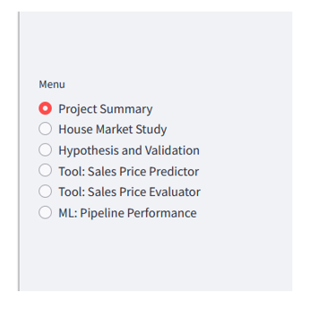
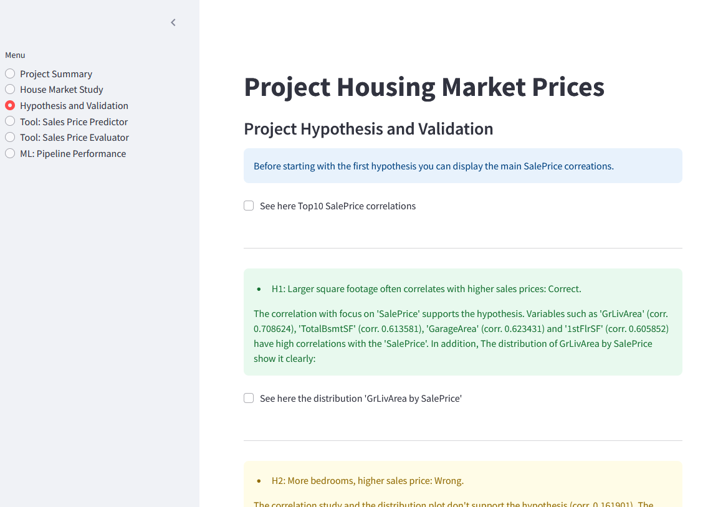
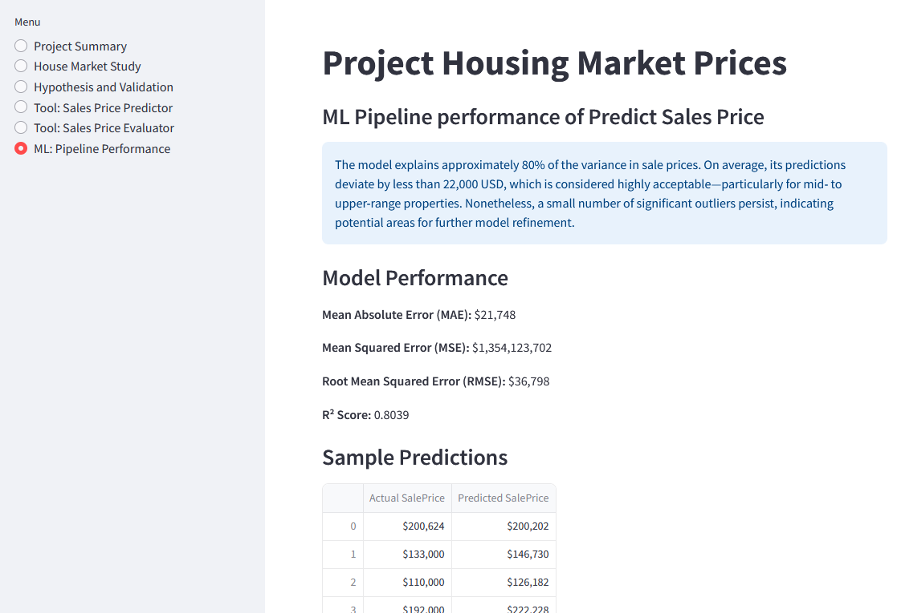

# Housing Market Prices

Welcome to my fith project[market house pricing](https://analyse-predict-house-market-5a00f7807683.herokuapp.com/). This dashboard contains a house market study adn a prediction function for a sales price. According to the project rewuriements and the introduction this dashboard is used by a friend who needs market insights since she is about to sell her houses in Iowa, Ames.

## Dashboard overview / features

### Menu / Navigation

This menu contains 6 links to the following pages:
*Quick Project Summary
*House Market Study
*Project Hypothesis and Validation
*Sales Price Predictor
*Sales Price Evaluator
*ML: Pipeline Perfoormance

### Quick Project Summary, Page 1

[page_project_summary](page_project_summary.py)

This site contains info blocks and a redirection to the README.me file.

### House Market Study, Page 2

[page_house_market_study](page_house_market_study.py)

This site contains 3 buttons (checkboxes) and graphics and three information blocks.

### Project Hypothesis and Validation, Page 3

[page_hypothesis_and_validation](page_hypothesis_and_validation.py)

This site contains 5 hypothesis with text/info blocks and for each hypothesis there is min. one visual support to determine the result.
By using the functions ".success" or ".warning" each hypothesis isvisually highlighted if its correct or wrong.

### Sales Price Predictor, Page 4

[page_sales_price_predictor](page_sales_price_predictor.py)

This site contains info text, a table, 5 widgets/ input forms and 5 buttons to predict the sales prices. The button "Run Predictive Analysis" deals with the manual input of the user. The other 4 buttons represent the parameters of the previded 4 inherited houses. Here it is ensured that business requirement 2 is shown to the user.

### Sales Price Evaluator, Page 5

[page_sales_price_evaluation](page_sales_price_evaluation.py)

This site contains info text, a table, 6 widgets/ input forms and 1 button to check if the provided sales price meets the predicted sales price. THis feature helps to validated if the deal is a good one or not.

### ML: Pipeline Perfoormance, Page 6

[page_pipeline_performance](page_pipeline_performance.py)

This site provides more detailed infromation about the pipelines used within this project.

## Project Kanban Board and User Stories

The project scope is defined as an MVP. The main functionalities for adding comments and methods, as well as browsing through the different methods, have been set up. The "must-have"-User Stories have been labeld as MVP in the GitHub project right at the beginning. Further User Stories have been added along the (MVP) project. The user stories have been defined, and all relevant ones for MVP 1 have been closed. In the column 'MVP2', there are user stories defined for further improvements and extensions after the project submission.

***[Project Kanban Board](https://github.com/users/Fl0W97/projects/4/views/1)***

### User Stories

#### Data Practitioners

|Story No.|Titel|User Story|
|---|---|---|
|#2|As Data Practitioner I can access and upload the client's dataset to prepare for next analysis steps.|
|#3|As Data Practitioner I preprocess the dataset so that I can continue with the analysis|
|[#4](https://github.com/Fl0W97/ci-c5-housing-market-prices/issues/4)|As Data Practioner I can get an overview about the house market so that I can prepare my next steps for feature Engineering and Modeling|
|[#5](https://github.com/Fl0W97/ci-c5-housing-market-prices/issues/5)|As a Data Practitioner I get an deep understanding of the dataset and using feature engineering tools so that I can prepare a data pipeline in the next work step.|
|[#6](https://github.com/Fl0W97/ci-c5-housing-market-prices/issues/6)|As Data Practitioner I create one or more pipeline models so that I can evaluate and also use the pipelines to meet the business requirement|
|#8|As a Data Practitioner and Business Stakeholder I can read through a detailed project description so that I understand what the project is about and what might be adjusted.|
|#11|As Data Practitioner I can see information (and evaluations) about the used pipelines and their performance so that I understand the process and what happens to get the final predictions.|

#### User / friend

|Story No.|Titel|User Story|
|---|---|---|
|[#1](https://github.com/Fl0W97/ci-c5-housing-market-prices/issues/1)|As a Site User I can *have live access to the dashboard so that I see the information and use functions of the dashboard|
|#7|As a User I want a properly working app so that I can understand the analysis of the house market properly, use the prediction feature and are not stop from error messages or failing functions.|
|#9|As User I can see a house market study so that I get an understanding of the house market.|
|#10|As User I can read hypothesis and validation approaches so that I understand if the hypothesis are correct or wrong.|
|#12|As User I get an overview of the project so that I can decide if it makes sense to deep dive.|
|#13|As User I can predict the sale price when I enter certain attributes so that I can define a sales price for my houses.|

## ML Business case - Step by step

This project closely follows the CRISP-DM (Cross-Industry Standard Process for Data Mining) workflow — a widely adopted framework for structuring data science and machine learning projects. It consists of six iterative phases: Business Understanding, Data Understanding, Data Preparation, Modeling, Evaluation, and Deployment.

Throughout this project, each step maps to the CRISP-DM process. Below, the workflow is broken down into chapters, with examples of how each phase has been addressed. It's important to note that the process is not strictly linear — as shown in the diagram below, the project involved moving back and forth between phases. For example, some decisions made during data cleaning or feature engineering were later revisited and adjusted based on new insights gained in later stages of the workflow.

### Business Understanding

The first step in the project focuses on developing a solid understanding of the business context and objectives. This includes an initial review of the dataset, which contains 1460 entries and 24 columns with clear and descriptive variable names. While a few columns are missing, the overall structure and content of the data are well-defined. In addition to exploring the data, the business requirements are outlined to ensure alignment with the project's goals. Finally, a set of initial hypotheses was formulated, each accompanied by a brief explanation of how it could be validated through data analysis.

#### Dataset Content

* The dataset is sourced from [Kaggle](https://www.kaggle.com/codeinstitute/housing-prices-data). A fictitious user story is applied where predictive analytics can be applied in a real project in the workplace.
* The dataset has almost 1.5 thousand rows and represents housing records from Ames, Iowa, indicating house profile (i.e. Floor Area, Basement, Garage, Kitchen, Lot, Porch, Wood Deck, Year Built) and its respective sale price for houses built between 1872 and 2010.

|Variable|Meaning|Units|
|:----|:----|:----|
|1stFlrSF|First Floor square feet|334 - 4692|
|2ndFlrSF|Second-floor square feet|0 - 2065|
|BedroomAbvGr|Bedrooms above grade (does NOT include basement bedrooms)|0 - 8|
|BsmtExposure|Refers to walkout or garden level walls|Gd: Good Exposure; Av: Average Exposure; Mn: Minimum Exposure; No: No Exposure; None: No Basement|
|BsmtFinType1|Rating of basement finished area|GLQ: Good Living Quarters; ALQ: Average Living Quarters; BLQ: Below Average Living Quarters; Rec: Average Rec Room; LwQ: Low Quality; Unf: Unfinshed; None: No Basement|
|BsmtFinSF1|Type 1 finished square feet|0 - 5644|
|BsmtUnfSF|Unfinished square feet of basement area|0 - 2336|
|TotalBsmtSF|Total square feet of basement area|0 - 6110|
|GarageArea|Size of garage in square feet|0 - 1418|
|GarageFinish|Interior finish of the garage|Fin: Finished; RFn: Rough Finished; Unf: Unfinished; None: No Garage|
|GarageYrBlt|Year garage was built|1900 - 2010|
|GrLivArea|Above grade (ground) living area square feet|334 - 5642|
|KitchenQual|Kitchen quality|Ex: Excellent; Gd: Good; TA: Typical/Average; Fa: Fair; Po: Poor|
|LotArea| Lot size in square feet|1300 - 215245|
|LotFrontage| Linear feet of street connected to property|21 - 313|
|MasVnrArea|Masonry veneer area in square feet|0 - 1600|
|EnclosedPorch|Enclosed porch area in square feet|0 - 286|
|OpenPorchSF|Open porch area in square feet|0 - 547|
|OverallCond|Rates the overall condition of the house|10: Very Excellent; 9: Excellent; 8: Very Good; 7: Good; 6: Above Average; 5: Average; 4: Below Average; 3: Fair; 2: Poor; 1: Very Poor|
|OverallQual|Rates the overall material and finish of the house|10: Very Excellent; 9: Excellent; 8: Very Good; 7: Good; 6: Above Average; 5: Average; 4: Below Average; 3: Fair; 2: Poor; 1: Very Poor|
|WoodDeckSF|Wood deck area in square feet|0 - 736|
|YearBuilt|Original construction date|1872 - 2010|
|YearRemodAdd|Remodel date (same as construction date if no remodelling or additions)|1950 - 2010|
|SalePrice|Sale Price|34900 - 755000|

#### Business Requirements

My friend received an inheritance from a deceased great-grandfather located in Ames, Iowa, to  help in maximising the sales price for the inherited properties.

Although my friend has an excellent understanding of property prices in her own state and residential area, she fears that basing her estimates for property worth on her current knowledge might lead to inaccurate appraisals. What makes a house desirable and valuable where she comes from might not be the same in Ames, Iowa. She found a public dataset with house prices for Ames, Iowa, and will provide you with that.

* 1 - The client is interested in discovering how the house attributes correlate with the sale price. Therefore, the client expects data visualisations of the correlated variables against the sale price to show that.

* 2 - The client is interested in predicting the house sale price from her four inherited houses and any other house in Ames, Iowa.

### Data collection

Jupyter nootebook: [01_data_collection](jupyter_notebooks/01_data_collection.ipynb)

The original dataset is downloaded from kaggle.com and provided by Code Institute, [Link details](https://www.kaggle.com/datasets/codeinstitute/housing-prices-data). It is unzipped and loaded into the project folder 'input'. There are three data files: One dataset contains the four inherited houses where the sales price should be defined, one file contains the metadata explanation and the last one "house_prices_records.csv" is the main dataset which is handled within this project, it contains variables.
By using pandas a DataFrame is defined and an initial inspection is performed to understand its structure, dimensions, and content (Load and inspect the Kaggle dataset).There are 1460 entries, 0 to 1459, and 24 data columns. Data types of all columns are reviewed to distinguish between numerical and non-numerical features, which is essential for preprocessing and model selection.

**The following parameter do not have a numeric type:**

['BsmtExposure', 'BsmtFinType1', 'GarageFinish', 'KitchenQual'], dtype='object'.

In addition, the dataset is analyzed to detect columns with missing values. The number of missing entries per column is calculated and presented in descending order to highlight areas requiring attention. 

**The following columns have missing Values:**

['EnclosedPorch', 'WoodDeckSF', 'LotFrontage ', 'GarageFinish', 'BsmtFinType1', 'BedroomAbvGr', '2ndFlrSF', 'GarageYrBlt', 'BsmtExposure', 'MasVnrArea']

Last but not least, columns containing zero values are identified and evaluated. The total number of zero values in the dataset is reported, along with a breakdown per column, to assess if zeros may represent missing or invalid data. What is suprising is the fact that the columns 'EnclosedPorch' and 'WoodDeckSF' have a hughe number of missing values, therefore, those variables are not considered for the further analysis.

**The following columns have the value zero:**

['MasVnrArea', '2ndFlrSF', 'openPorchSF', 'BsmtFinSF1', 'BsmtUnfSF', 'EnclosedPorch', 'GarageArea', 'WoodDeckSF', 'TotalBsmtSF', 'BedroomAbvGr']

All values should remain, since it is an indication that the relevant attribute is not available.

With regards to the used code, here a few exampes of the mostly used code snippets that has been (re)used:

|Code snippet|library|Explanation|Comment|
|---|---|---|---|
| df.info() | pandas | Provides dataset df information | |
| df.isnull() | pandas | identifies missing values in the dataset df | |
| os.makedirs(name='outputs/data_collected') | os | creates a folder in repo | |

### Data cleaning

Jupyter notebook: [02_data_cleaning](jupyter_notebooks/02_data_cleaning.ipynb)

The data cleaning phase focus on preparing the dataset for analysis and modeling by improving its quality and consistency. This included handling missing values and correcting incorrect data types. Outliers that could distort model performance haven't been identified. A correlation matrix was created to better understand relationships between features and identify potential issues such as multicollinearity. After cleaning, the dataset was split into training and test sets to support proper model validation. All cleaned and prepared data, along with relevant scripts and notebooks, was versioned and pushed to the repository 'outputs/data_cleaned/...'.

#### Handling missing values

There are missing data. For cleaning it the function DataCleaningEffect() is used (from feature-engine lession)

a. Drop Columns:
If a column has a very high proportion of missing data such as 'EnclosedPorch' and 'WoodDeckSF', it may be best to drop the column altogether. As well as for LotFrontage (259 missing).

b. Impute Missing Values:
For columns with a moderate amount of missing data, imputation is a good strategy. There are different methods for imputing based on the nature of the data

* For numeric columns (i.e. '2ndFlrSF', 'BedroomAbvGr'): You can impute the missing values using the mean, median, or mode (depending on the distribution of the data). The median is often a good choice for columns with skewed distributions or outliers.
* For categorical columns (i.e. 'BsmtFinType1', 'GarageFinish'): Impute the missing values with the mode (most frequent value) since these are categorical variables.
* For columns like 'MasVnrArea' (small number of missing values): Since MasVnrArea has only 8 missing values, impute using the mean or median, or even consider using the mode depending on the column’s nature. If the percentage is very small, drop rows with missing values in some cases.
* For 'GarageYrBlt' (81 missing): An imputation with with the mode or mean of the year values is not useful. Using a more sophisticated method, like predictive modeling or filling based on group statistics (e.g., grouping by the presence of a garage) is better. However, since it will be dropped in a later step no further correction is made.

c. Fill Missing values with Specific Values:
For certain categorical columns, you might want to fill missing values with a specific placeholder like 'Unknown' or 'None'.

**Current approach:**

* Drop columns with a very high percentage of missing values (e.g., EnclosedPorch, WoodDeckSF)
* Impute missing values for columns with moderate missing data:
  * Numeric columns '2ndFlrSF', 'BedroomAbvGr', 'LotFrontage', 'GarageYrBlt' using the mean, median, or mode.
  * Categorical columns 'BsmtExposure', 'BsmtFinType1', 'GarageFinish' using the mode (most frequent value).
* For small missing data counts (e.g., MasVnrArea), impute with the mean or median.

Considering regression-based and model-based imputation for more advanced techniques (tbd!!MERIT!!)

|Code snippet|library|Explanation|Comment|
|---|---|---|---|
| df.drop(columns=['...', '...']) | ... | ... | ... |
| df['...'].fillna(df['...'].median()) | ... | ... | ... |
| df['...'].fillna(df['...'].mean()) | ... | ... | ... |

#### Correcting incorrect data types

In the provided dataset there are the following four variables which don't have numeric values.

* 'BsmtExposure'
* 'BsmtFinType1'
* 'GarageFinish'
* 'KitchenQual'

For further analysing steps and for the pipeline processing it is mandatory to transfrom those to numeric values. That is done with astype(str)

1. Convert the columns to string type (it will handle NaN as 'nan' string)
2. Strip any leading/trailing whitespace from the column values
3. Replace string representation of 'NaN' with 'Unknown'
4. Map categorical values to numeric
5. Check the unique values to confirm that the columns contain only valid values
6. Apply numeric conversion safely (handle non-numeric values)

|Code snippet|library|Explanation|Comment|
|---|---|---|---|
| df.info() | ... | ... | ... |
| df['...'].astype(str) | pandas | Convert the columns to string type | |
| df['...'].str.strip() | pandas | Strip any leading/trailing whitespace from the column values | |
| df['...'].replace("nan", "Unknown") | pandas | Replace string representation and map categorical values to numeric | |
| pd.to_numeric(df['...'], errors='coerce') | pandas | Apply numeric conversion safely (handle non-numeric values) | |

#### Handling zeros in the dataset

The analysis shows that there are zeros in the dataset. Whether those should be transformed depends on:

* The nature of the feature (binary, categorical, or continuous).
* The interpretation of zeros (absence vs. a true zero value).
* The impact of zeros on the target variable (do they have predictive power?).

The zeros represent absence of a feature (e.g., 2ndFlBsmt is a binary flag indicating the presence of a second-floor basement). There are two opitons: A - creating additional features (like a binary indicator for zero values) or B - leave them as-is. I decided to leave them as-is since the zeros show that a certain feature is not available. Currently a categorical approach by identifiying yes or no of a feature is not part of the analysis.

#### Correlation matrix

The correlation gives an early insight into data quality, structure, and relationships, helping to clean and shape the data more effectively for modeling. It becomes clear that the highes correlations with 'SalePrice' are 'OverallQual' and 'GrLivArea'.
In addition, it shows that there are 13 columns that contains varibales with a medium correlation between 0.3 and 0.7 and there are 6 columns with a correlation lower than 03.

#### High Correlation: Correlation coefficient >0.7

- OverallQual      0.790982
- GrLivArea        0.708624

#### Medium Correlation: Correlation coefficient [0.3,0.7]

- KitchenQual      0.659600
- GarageArea       0.623431
- TotalBsmtSF      0.613581
- 1stFlrSF         0.605852
- YearBuilt        0.522897
- YearRemodAdd     0.507101
- MasVnrArea       0.477493
- GarageYrBlt      0.466754
- GarageFinish     0.465039
- BsmtFinSF1       0.386420
- LotFrontage      0.334771
- OpenPorchSF      0.315856
- 2ndFlrSF         0.312479

#### Low Correlation: Correlation coefficient <0.3

- LotArea          0.263843
- BsmtFinType1     0.261373
- BsmtExposure     0.229632
- BsmtUnfSF        0.214479
- BedroomAbvGr     0.155784
- OverallCond     -0.077856

|Code snippet|library|Explanation|Comment|
|---|---|---|---|
| correlation_matrix = df.corr() | pandas | create a correlation matrix | |
| correlation_matrix['SalePrice'].sort_values(ascending=False) | pandas | focusing on SalesPrice correlations and sort | |
| plt.figure(), plt.title(), plt.show() | matplotlib.pyplot | create a graphic | |
| sns.heatmap(correlation_matrix, annot=True, fmt=".2f", cmap="coolwarm", cbar=True) | seaborn | create a graphic/heatmap | |

#### Split into training and test sets
The split into trianing and test data is processed a few times wihtin this project. Both datasets are mandatory to apply a ML pipleline. It is a preparation for the next chapters.

|Code snippet|library|Explanation|Comment|
|---|---|---|---|
| os.makedirs(name='...') | os | create a folder for the test and train sets | ... |
| TrainSet, TestSet = train_test_split(df, test_size=0.3, random_state=42) | sklearn| Split data into train and test sets | ... |
| TestSet.to_csv("outputs/data_cleaned/TestSet.csv", index=False) | os, pandas | Save the DataFrame to CSV | ... |
| TrainSet.to_csv("outputs/data_cleaned/TestSet.csv", index=False) | os, pandas | Save the DataFrame to CSV | ... |

### House Market Study

#### Hypothesis and how to validate

Jupyter notebook: [02b_house_market_study](jupyter_notebooks/02b_house_market_study.ipynb)

##### Hypothesis (H1): Larger square footage often correlates with higher sales prices. (Correct.)

I suspect the sales price correlates with a high amount of ground living area. For the validation there are two approaches:

* Analyse the dataset and provide a correlation analysis about sales price.
* Plot a distribution of price vs square_footage. To separate both of these variables.

Validation:
See correlation analysis. The Correlation value GrLivArea/SalePrice is high (0.71)
[02_data_cleaning: Correlation analysis](jupyter_notebooks/02b_house_market_study.ipynb)

[02b_house_market_study: Distribution of GrLivArea by SalePrice](jupyter_notebooks/02b_house_market_study.ipynb)

##### Hypothesis (H2): More bedrooms, higher sales price. (Wrong.)

I suspect the sales price correlates with a high amount of bedrooms. For the validation there are two approaches:

* Analyse the dataset and provide a correlation analysis about sales price.
* Use boxplots or plot of price vs number of bedrooms to compare average prices across different numbers of bedrooms.

Validation:
See correlation analysis above. The Correlation value BedroomAbvGr/SalePrice is very low (0.16)

[02b_house_market_study: Distribution of Bedroomabvgr by SalePrice](jupyter_notebooks/02b_house_market_study.ipynb)

##### Hypothesis (H3): Better OverallCond, higher sales price. (Wrong.)

I suspect the sales price correlates with a high 'OverallCond'. For the validation there are two approaches:

* Analyse the dataset and provide a correlation analysis about sales price.
* Use boxplots or plot of price vs overall condition to compare average prices across categories of overall condition.

Validation:
See correlation analysis above. The Correlation value OverallCond/SalePrice is very low (-0.078)

[02b_house_market_study: Distribution of OverallCond by SalePrice](jupyter_notebooks/02b_house_market_study.ipynb)

##### Hypothesis (H4): Renovated houses sell for more (Partly correct.)

I suspect the sales price correlates with a house that has been renovated more recently, this is shown by variable 'RemodAdd'. For the validation there are two approaches:

* Compare average prices of renovated vs not renovated homes.
* Check if the year of renovation is recent, and see if it correlates with price increase.
* Apply statistical test: t-test.

Validation:
See correlation analysis above. The Correlation value YearRemodadd/SalePrice is medium (0.51)

[02b_house_market_study: Distribution of YearRemodadd by SalePrice](jupyter_notebooks/02b_house_market_study.ipynb)

##### Hypothesis (H5): Newer houses are more expensive (Partly correct.)

I suspect the sales price correlates with a recent house completion. For the validation there are two approaches:

* Compare average prices of new vsold houses.
* Run correlation and scatterplots, or use regression analysis.
* Apply control for confounding. Compare houses of similar characteristics (e.g., same GrLivArea, OverallQual, etc.), only differing in YearBuilt.
* Apply statistical test: t-test.

Validation:
See correlation analysis above. The Correlation value year_built/SalePrice is medium (0.52)

#### The rationale to map the business requirements to the Data Visualisations and ML tasks

List of business requirements and a rationale to map them to the Data Visualisations and ML tasks.

|  Business requierement | relevant section of visualisations and ML task |
| --- | --- |
| 1 | See [02b_data_cleaning](jupyter_notebooks/02b_house_market_study.ipynb) |
| 2 | See [04_modeling and evaluation](jupyter_notebooks/04_modeling_and_evaluation.ipynb) |

### Feature Engineering

Jupyter notebook: [03_featureEngineering](jupyter_notebooks/featureEngineering.ipynb)

#### YData Profiling Report

The report enables to have a closer look at each variable. The following insighs are noticeable:

|Variable|Comment|
|--|--|
| 2stFlrSF | ~59% zeros, only 41% of the houses have a 2st floor |
| BsmtFinSF1 | 32% of the houses don't have a basement |
| GarageArea | 94% of the houses have a garage, it seems a garage is not a convenient, but mandatory attribute in the market. If a garage is finished or unfinished is not correlating with sales price. |
| TotalBsmtSF | THere are only 2,5% of the houses which don't have a basement. It seems a basement is a mandatory attribute. |
| YearBuilt | A big amount of houses in the dataset has been built around 2000 (!! Details!!). It seems there are a lot new houses in the market. |
| YearRemodAdd | A noticable amount of houses has been renovated around 2000. (!! Details!!) |

(!!!Add IMAGE!!!)

|Code snippet|library|Explanation|Comment|
|---|---|---|---|
| ... | ... | ... | ... |

#### 1. Categorical Encoding

Categorical variables represent discrete categories. Machine learning models generally require numeric inputs, so categorical variables must be encoded into a numerical form. For the convertion the Label Encoding has been applied. It assigns each category a unique integer.

In the jupyter notebook '02_data cleaning'. The following parameters has been transformed (for correlation analysis): 'BsmtExposure', 'BsmtFinType1' and 'GarageFinish'.
In jupyter notebook '04_modeling_and_evaluation'. The following parameters has been transformed (for pipeline model): (...).

|Code snippet|library|Explanation|Comment|
|---|---|---|---|
| ... | ... | ... | ... |

#### 2. Numerical Transformation

Numerical features often need to be transformed to improve model performance, especially if their distribution is skewed.
Common Transformation Techniques:

* Normalization: Scaling the values to a range, typically between 0 and 1.
* Standardization: Scaling the values to have a mean of 0 and a standard deviation of 1.
* Log Transformation: Helps with highly skewed data by compressing the range.

Within this project the log transformation is done for 'SalePrice' and 'GarageArea' since thir distribution is skewed.

|Code snippet|library|Explanation|Comment|
|---|---|---|---|
| ... | ... | ... | ... |

#### 3. Smart Correlation Selection

In a dataset, some features may be highly correlated with others. Keeping highly correlated features in a model can lead to multicollinearity, which can negatively impact model performance.
Method to Select Features Based on Correlation:

* Correlation Matrix: You can compute the correlation matrix to find highly correlated pairs.
* Threshold-based Feature Removal: Remove features that have a correlation higher than a certain threshold, e.g., 0.8 or -0.8.

Within this project, based on the correlation analysis for salePrice and further interpretation of the context the following parameters will be ignored:
'TotalBsmtSF', '1stFlrSF', 'YearRemodAdd', 'GarageYrBlt', 'MasVnrArea', 'BsmtFinSF1', '2ndFlrSF'

***1stFlrSF***:

This feature represents the area of the first floor. It is likely correlated with other features like GrLivArea (the total above-ground living area) or TotalBsmtSF (the total basement area). Including both could introduce redundancy in the model.

Action: Drop this feature to avoid multicollinearity. Keep GrLivArea as it represents the total above-ground living space, which is likely more informative.

***GrLivArea***:

This feature is related to some variables related to the total above-ground living area, which is a strong indicator of house size and price. It’s already closely related to 1stFlrSF, TotalBsmtSF, TotalArea and might also have a relationship with 2ndFlrSF.

Action: This feature is kept. However, feature 2ndFlrSF is being dropped to simplify the model and reduce multicollinearity.

***SalePrice***:

This is the log-transformed version of the target variable, SalePrice. It's highly correlated with GarageArea as well, as shown in the earlier analysis. Since SalePrice is the target variable (the dependent variable you are trying to predict), it should not be used as an independent variable in the model. Hence, it’s correct to drop this feature from the set of predictors, but still necessary for the train and test set.

Action:  'Saleprice' is kept for test and train set. 'GarageArea' is dropped.

***OverallQual***:

This feature represents the overall quality of the house and is highly correlated with KitchenQual and YearBuilt. Since OverallQual is a general measure of the house’s quality, it may be more valuable for predicting SalePrice than other more specific quality features like KitchenQual. In addition, OverallQual does have the highest correlation to SalePrice in the correlation anylsis (02_data_cleaning).

Action: OverallQual is kept, YearBuilt is dropped.

***KitchenQual***:

This feature represents the quality of the kitchen, which may be closely related to the overall quality of the house (OverallQual). Dropping one of these two features will reduce redundancy in your dataset.

Action: Drop KitchenQual because OverallQual might already capture the overall quality of the house, including the kitchen.

#### 4. Discretization (Binning)

Discretization (or binning) is the process of transforming continuous variables into categorical ones. This is useful if you want to reduce the impact of outliers or make certain trends more interpretable.

Ideas:

* 'EnlosedPorch': 1. Yes, 2. No
* 'MasVnrArea': 1. Yes, 2. No
(in progress)

|Code snippet|library|Explanation|Comment|
|---|---|---|---|
| ... | ... | ... | ... |

#### 5. Outlier Detection and Treatment

Outliers can distort model performance and lead to incorrect predictions. Various methods can be used to detect and handle outliers.
Common Outlier Detection Methods:

* IQR (Interquartile Range) Method: Detect outliers based on the IQR, typically using a threshold of 1.5 * IQR.
* Z-score Method: Detect outliers based on the Z-score (values above a certain threshold).

Since the outliers for SalePrice represent real, valid data points, I keep them in the model. The dataset contains examples of extreme property prices, the model should be trained on those extreme values. This ensures the model can predict for higher prices in the future. Example: If you have properties worth $1,000,000 or more, and they are valid sales, it’s important to include them.

A log transformation to the target variable SalePrice is used for Numerical Transformation. This transformation will compress the high values, making the distribution more symmetric and reducing the effect of extreme values, but still allowing the model to learn the overall patterns.

Some machine learning models are more robust to outliers than others. For instance: Random Forest, Gradient Boosting (like XGBoost), and Decision Trees handle outliers relatively well. Linear regression models, however, are more sensitive to extreme outliers and might give distorted results when exposed to such values. Therefore, a more robust ML model is selected.

#### Feature Engineering Spreadsheet summary

* Categorical Encoding (already done in 02_data_cleaning)
* Numerical Transformation (log transformation): 'SalePrice', 'GrLivArea'
* Smart Correlated Selection (there are a various varables with can be dropped due to a high correlation match): ['TotalBsmtSF', '1stFlrSF', 'GarageArea', 'GrLivArea', '2ndFlrSF', 'SalePrice', 'KitchenQual', 'YearBuilt']

| variabels | comment | correlation with SalePrice | Potential Feature Engineering Transformers |
|---|---|---|---|
|Sale Price| | 1 | Numerical Transformation |
|1stFlrSF|  |  |  |
|2ndFlrSF| MIssing values are filled up by adding median()  |  |  |
|BedroomAbvGr| droped from dataset due to low correlation | | |
|BsmtExposure| identified as dtype='object', droped from dataset due to low correlation | | |
|BsmtFinType1| droped from dataset due to low correlation | | |
|BsmtFinSF1| identified as dtype='object' |  |  |
|BsmtUnfSF| droped from dataset due to low correlation | | |
|TotalBsmtSF|  |  |  |
|GarageArea|  |  |  |
|GarageFinish| identified as dtype='object', Missing values (NaNs) in the GarageFinish columns are filled wih the most frequent value found in that column. | | |
|GarageYrBlt|  |  |  |
|GrLivArea|  |  |  |
|KitchenQual| identified as dtype='object' |  |  |
|LotArea|  droped from dataset due to low correlation | | |
|LotFrontage|  |  |  |
|MasVnrArea| It fills all missing values in the MasVnrArea column with the mean of the existing (non-null) values in that column. |  |  |
|EnclosedPorch| droped from dataset due to low correlation and high number of missing values.|  |  |
|OpenPorchSF|  |  |  |
|OverallCond| droped from dataset due to low correlation | | |
|OverallQual|  | 0.790982 | |
|WoodDeckSF| droped from dataset due to low correlation and high number of missing values |  |  |
|YearBuilt|  |  |  |
|YearRemodAdd|  |  |  |

### Modeling

Jupyter notebook: [04_modeling_and_evaluation_regression](04_modeling_and_evaluation_regression.ipynb)

#### Data Cleaning and Feature Engineering pipeline

#### regression pipeline

### Evaluation

Jupyter notebook: [04_modeling_and_evaluation_regression](04_modeling_and_evaluation_regression.ipynb)

### Deployment

#### Heroku

* The [App live link](https://analyse-predict-house-market-5a00f7807683.herokuapp.com/)
* The project was deployed to Heroku using the following steps.

#### Preparation

Make sure that the following files are created in the project environment before connect it with Heroku:

* setup.sh
    mkdir -p ~/.streamlit/
    echo "\
    [server]\n\
    headless = true\n\
    port = $PORT\n\
    enableCORS = false\n\
    \n\
    " > ~/.streamlit/config.toml """

* Procfile
    web: sh setup.sh && streamlit run app.py

* runtime.txt
    python-3.12.8

* requirements.txt
    numpy==1.26.1
    pandas==2.1.1
    matplotlib==3.8.0
    seaborn==0.13.2
    ydata-profiling==4.12.0 (can be removed from requirements before deployment)
    plotly==5.17.0
    ppscore==1.1.0 (can be removed from requirements before deployment)
    streamlit==1.40.2
    feature-engine==1.6.1
    imbalanced-learn==0.11.0
    scikit-learn==1.3.1
    xgboost==1.7.6
    yellowbrick==1.5 (can be removed from requirements before deployment)
    Pillow==10.0.1 (can be removed from requirements before deployment)

* Using .slugignore for reducing slug size

#### Deployment steps

1. Log in to Heroku and create an App
2. At the Deploy tab, select GitHub as the deployment method.
3. Select your repository name and click Search. Once it is found, click Connect.
4. Select the branch you want to deploy, then click Deploy Branch.
5. The deployment process should happen smoothly if all deployment files are fully functional. Click the button Open App on the top of the page to access your App.
6. If the slug size is too large then add large files not required for the app to the .slugignore file.

## Dashboard Design

* List all dashboard pages and their content, either blocks of information or widgets, like buttons, checkboxes, images, or any other items that your dashboard library supports.

| Dashboard page name | Screenshot | Content | Comment |
|---|---|---|---|---|
| page_project summary |  |  |  |
| page_house_market_study |  |  |  |
| page_project_hypothesis_and_validation |  |  |  |
| page_sales_price_predictor |  |  widgets |  |
| page_pipeline_performance |  |  |  |

## Testing

For detailed testing information, see the content related to testing in [TESTING.md](TESTING.md).

## Tools & Technologies used

### Main Data Analysis and Machine Learning Libraries

* numpy==1.26.1
* pandas==2.1.1
* matplotlib==3.8.0
* seaborn==0.13.2
* ydata-profiling==4.12.0 # removed from requirements before deployment
* plotly==5.17.0
* ppscore==1.1.0 # removed from requirements before deployment (tbc)
* streamlit==1.40.2
* feature-engine==1.6.1
* imbalanced-learn==0.11.0 (tbc)
* scikit-learn==1.3.1
* xgboost==1.7.6 (tbc)
* yellowbrick==1.5 # removed from requirements before deployment (tbc)
* Pillow==10.0.1 # removed from requirements before deployment (tbc)

### Languages

*Python 3.12.1: The primary programming language used for developing the backend of the website.

### Other tools

* Jupyter Notebook
* Git: The version control system that tracks changes in the code and enables collaboration among developers.
* Gitpod: A cloud-based IDE used for local development and coding.
* Pip3: The Python package manager used to install and manage project dependencies.
* GitHub: A platform that hosts the website’s source code and facilitates project management through features like the Kanban board.
* Font Awesome: A library used to incorporate scalable vector icons into the website.
* PEP8: A tool used to check the Python code against the PEP8 coding standards for readability and consistency.
* Heroku: A cloud platform used to deploy and host the website in a production environment.
* Languagetool: Free grammar checker for checking my project documentation

## Credits

* In this section, you find reference where I got content, media and extra help from:

### Content

* The text for the Dahsboard was taken partly from Code Institute Walkthorugh 02
* Ideas and supprot of plot analysis was taken from [Specific YouTube Tutorial](https://www.youtube.com/) (to be added)
* The icons in the footer were taken from [Font Awesome](https://fontawesome.com/) (to be added)
* The template for this project was provided by Code Institute
* The structure of the documentation has been reused from my project 4

### Media

* The photos used on the home and sign-up page are from This Open Source site
* The images used for the gallery page were taken from the Code Institute Course 'Delivering Data Science Projects Data Culture and CRISP-DM Workflow CRISP-DM Workflow'
* The images used for the dashboard page XY were taken from (to be added)

### Templates

*For this project I reused the provided [Code Institute Template](https://github.com/Code-Institute-Solutions/milestone-project-heritage-housing-issues)

## Cloud IDE Reminders (???)

To log into the Heroku toolbelt CLI:

1. Log in to your Heroku account and go to *Account Settings* in the menu under your avatar.
2. Scroll down to the *API Key* and click *Reveal*
3. Copy the key
4. In your Cloud IDE, from the terminal, run `heroku_config`
5. Paste in your API key when asked

You can now use the `heroku` CLI program - try running `heroku apps` to confirm it works. This API key is unique and private to you so do not share it. If you accidentally make it public then you can create a new one with *Regenerate API Key*.
