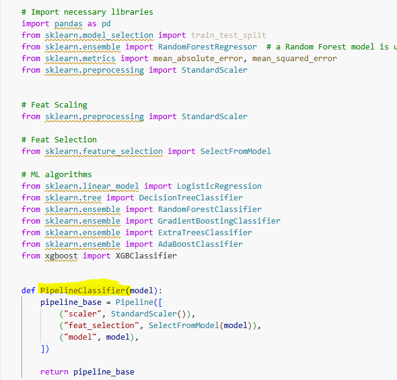
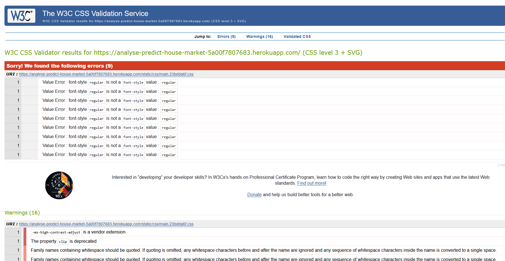

# Testing

*Testing was conducted regularly in small intervals throughout the development process as well as at the end of the project to ensure functionality and identify any potential issues early on.
*Bugs that were encountered during testing have been thoroughly documented in the Bug section, detailing the nature of the issue and the steps taken to resolve it.
*Validators were used to ensure that the code meets all necessary standards and specifications. More details can be found in the Validators chapter.
*Logic checks were performed to verify that the program's operations and algorithms were working as intended. This included testing different scenarios and edge cases to ensure robustness.
*Manual input tests were carried out to simulate real-world usage of the application. This involved entering data manually into the system to ensure that all inputs were handled correctly and that the user interface responded appropriately.

## Manual Testing Plan
|Test Area|Objective|Test Steps|Test Cases|Test Completed|Comments|
|---|---|---|---|---|---|
|Navigation Functionality|Ensure that the website navigation is intuitive and functional.| 1. Open the homepage.   2. Click on various menu items or links.   3. Verify correct redirection.   4. Verify active menu item highlight.   5. Test the menu hide feature.|- **Responsive Navigation**: Test navigation across different screen sizes.   - **Menu Items**: Ensure the menu items lead to correct pages.|[ y ]|---|
|Project Summary|Ensure that the summary page content is understandable, describes the project and has a structured format and the available functions work| 1. Read through project overview and terminology sections.   2. Check the functionality of the README.md link. |- Project is clearly described.   - Key terms and business context are explained.   - External links work correctly.|[ y ]|---|
|House Market Study|Ensure that the page content is clear and the interactive elements work as expected.| 1. Test Checkbox 'Inspect House market data'   2. Test Checkbox 'Show SalePrice Distribution'   3. Test Checkbox 'Inspect Correlation Heatmap'|- Visualizations render correctly.   - Information is clearly presented.   - All checkboxes trigger the correct outputs.|[ y ]|---|
|Tool: Hypothesis and Validation|Ensure that the hypothesis testing visualizations and conclusions are understandable.|1. View correlation heatmap.   2. View distribution plots for 'GrLivArea', 'BedroomAbvGr', 'OverallCond'.   3. Compare graphics about prices between Renovated/Non-renovated and New/Old houses.|- Charts load and update correctly.   - Price comparisons are visible and logical.   - Hypotheses are supported with clear visual evidence.|[ y ]|---|
|Tool: Sales Price Predictor|Ensure that the model correctly predicts prices based on input or predefined data.| 1. Fill out 5 input widgets.   2. Click 'Predictive Analysis'.   3. Use buttons to predict prices for predefined houses (House 1–4). | - Input is accepted and processed.   - Predictions are displayed for both custom and predefined inputs.|[ y ]|---|
|Tool: Sales Price Evaluator|Ensure that the evaluator can determine if a price is a good deal compared to market prediction.| 1. Fill out 5 feature input widgets.   2. Enter a sales price.   3. Click 'Run Price Check'.|- Market value is predicted.   - User's input price is compared to predicted value.   - App states whether it’s a good, bad, or fair deal.|[ y ]|---|
|ML: Pipeline Performance|Ensure that machine learning pipeline steps and performance metrics are correctly displayed. |  1. Review pipeline visualizations (data cleaning, feature engineering, regression).   2. Check model evaluation values (e.g., MAE, R²). |- Pipeline structure is explained.   - Performance metrics are clearly visible and accurate.   - Models are logically compared if applicable.|[ y ]|---|

## Additional Testing Considerations

These are additional tests to ensure the overall quality, performance, security, and compatibility of the website across different platforms.

| **Test Area** | **Objective** | **Test Steps**| **Test Cases** | **Test Completed** | **Comments** |
|---------------|-------------- |---------------|----------------|--------------------|--------------|
| **1. Cross-browser Testing** | Ensure the website works correctly across different web browsers.                                                | 1. Open the website in Chrome.   2. Open the website in Firefox.   3. Open the website in Edge.   4. Open the website in Safari.   5. Test basic functionality (navigation, login, forms) in each browser. | - **Browser Compatibility**: Ensure that features are functional across Chrome, Firefox, Edge, and Safari.   - **CSS and Layout**: Verify the website layout and styles appear correctly in all browsers.   - **JavaScript**: Ensure JavaScript runs properly across all browsers.   - **Responsive Layout**: Test that the website is responsive and adapts to different screen sizes in each browser. |[ y ]||
| **2. Mobile Testing**        | Ensure that the website is fully responsive and works on different mobile devices.                               | 1. Open the website on a mobile device (or simulate using browser dev tools).   2. Test website navigation.   3. Test form submissions and interactive elements (login, comment forms, etc.) on mobile.   4. Test responsiveness on different screen sizes. | - **Mobile Compatibility**: Ensure the website is usable on mobile browsers (Chrome, Safari, Firefox).   - **Touch Interaction**: Test touch interactions, such as tapping and swiping.   - **Mobile Layout**: Verify proper layout on small screens and large mobile devices.   - **Performance on Mobile**: Ensure the website loads and interacts on mobile devices. |[ y ]||

## Testing User Stories

### User Stories for Data Practitioner

**No.** | **User Story** | **Requirement met (y/n)** |
| ------|--------------- |---------------------------|
|#2|As Data Practitioner I can access and upload the client's dataset to prepare for next analysis steps.| y |
|#3|As Data Practitioner I preprocess the dataset so that I can continue with the analysis| y |
|[#4](https://github.com/Fl0W97/ci-c5-housing-market-prices/issues/4)|As Data Practioner I can get an overview about the house market so that I can prepare my next steps for feature Engineering and Modeling| y |
|[#5](https://github.com/Fl0W97/ci-c5-housing-market-prices/issues/5)|As a Data Practitioner I get an deep understanding of the dataset and using feature engineering tools so that I can prepare a data pipeline in the next work step.| y |
|[#6](https://github.com/Fl0W97/ci-c5-housing-market-prices/issues/6)|As Data Practitioner I create one or more pipeline models so that I can evaluate and also use the pipelines to meet the business requirement| y |
|#8|As a Data Practitioner and Business Stakeholder I can read through a detailed project description so that I understand what the project is about and what might be adjusted.| y |
|#11|As Data Practitioner I can see information (and evaluations) about the used pipelines and their performance so that I understand the process and what happens to get the final predictions.| y |

### User Stories for User

**No.** | **User Story** | **Requirement met (y/n)** |
| ------|--------------- |---------------------------|
|[#1](https://github.com/Fl0W97/ci-c5-housing-market-prices/issues/1)|As a Site User I can *have live access to the dashboard so that I see the information and use functions of the dashboard| y |
|#7|As a User I want a properly working app so that I can understand the analysis of the house market properly, use the prediction feature and are not stop from error messages or failing functions.| y |
|#9|As User I can see a house market study so that I get an understanding of the house market.| y |
|#10|As User I can read hypothesis and validation approaches so that I understand if the hypothesis are correct or wrong.| y |
|#12|As User I get an overview of the project so that I can decide if it makes sense to deep dive.| y |
|#13|As User I can predict the sale price when I enter certain attributes so that I can define a sales price for my houses.| y |

## Unfixed Bugs

There are no unfixed bugs.

## Fixed Bugs

| Bug name |Error message|Image error message|Code|Comment, description|Fix|
|---|---|---|---|---|---|
| Error missing variable | KeyError: "['TotalArea'] not found in axis" || df_engineering = df_engineering.drop(columns=['TotalBsmtSF', '1stFlrSF', 'GarageArea', '2ndFlrSF', 'KitchenQual', 'YearBuilt', 'TotalArea']) | The variable 'TotalArea' is not existing (anymore) It was added to create a new varibale and combine other variable such as GrLivArea, 1stFlr, 2ndFllr. But it did not added value to the analysis. | The variable has been removed. |
| Error running multiple algorithms | NameError: name 'PipelineClf' is not defined |  |   | ... | The pipeline was renamed. 'PipelineClf' doesn't exist. It was a copy & paste failure |
| Error scaling data |---|---|---|---|---|
| Error target imbalancing  |---|---|---|---|---|
| Error by running streamlit |---|---|---|---|---|
| Error widget dashboard drop unwanted columns |---|---|---| ipynb format cannot be handled. | The Drop function has been shifted to an own file src.preprocessing.py |
| Error widget dashboard columns drop |---|---|---| wrong variables in test/train |---|
| Error widget dashboard overallqual |---|---|---| Due to a typo the widget name couldn't be found | name is corrected |

## Validator Testing
Validator testing has been done on:

### [CI Python validator](https://pep8ci.herokuapp.com/)
No errors were returned.

    
see details about CI Python validator

#### app.py

#### app_pages/multipage.py

#### app_pages/page_project_summary.py

#### app_pages/page_house_market_study.py

#### app_pages/page_hypothesis_and_validation.py

#### app_pages/page_sales_price_predictor.py

#### app_pages/page_sales_price_evaluation.py

#### app_pages/page_pipeline_performance.py

#### src/data_management.py

#### src/preprocessing.py

#### src/machine_learning/predictive_analysis_ui

### [HTML validator](https://validator.w3.org/)
No errors were returned.

    
see details about HTML validator

No errors were returned

#### Dashboard

### [CSS validator](https://jigsaw.w3.org/css-validator/)
No errors were returned

    
see details about CSS validator

#### Dashboard

### Validation functions for Dashboard
In Streamlit a few validation funtions are applied as standard i.e. by using a widget input data is only accepted when they are correct.

## Lighthouse Reports
LightHouse is a web performance testing tool used to assess a website's performance. The report is generated through Google Chrome.

## Responisvness
The responsiveness was manually tested using Chrome's devtools throughout the entire development process.

## Accessability
I confirm that the selected colors and fonts are easy to read and accessible by using Lighthouse in devtools (Chrome), see chapter "Lighthouse reports".
